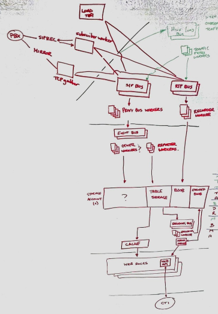

Over the past several months, the company I work for has been creating a new product which ties into *"Critical UK Infrastructure"*. As you might imagine, the security obligations that come with such integration are... considerable. I've always thought myself pretty savvy when it comes to securing the software I write, with sufficient networking, operating system, and web knowledge to at least apply *above average* controls to ensure the protection of the data that the systems I work with handle. I'll freely admit that my ability to document and convey the controls, risks, systems, have *not* been sufficient to pass the arduous government driven security assessments faced without a fair degree of re-education. As part of that re-education though, I've definitely picked up and put into place practices that I'd continue in the future, even working on smaller projects or those without any obligations beyond the layman's honour to protect ones clients and customers.

_Image from [MemeCenter](https://www.memecenter.com/fun/5146659/security)_
{: style="font-size: 12px; text-align: center;"}

In this article, I want to describe some of the practices I now use, and will continue to use in future agile projects. My intent isn't to describe to you how Enterprise scale software should be written or how to protect against SQL injection; instead I want to show the average developer what they should be considering, and how this can work seamlessly with your existing methodologies.

> I recently gave a [30 minute talk](https://youtu.be/45F1rjzvkuA) on this subject at [.Net Bournemouth](https://meet.dnbmth.io) - not all aspects of this article are covered by the talk (I had to cut a lot to fit it into 30 minutes), but feel free to check it out!

## Threats

To begin to understand why you should be spending time reading this article and improving your security practices, take a look at this [impressive visualisation of live attacks](https://map.norsecorp.com/#/) from [Norse Corp](http://www.norse-corp.com/). Honestly, open it in a new a tab and check it out for a minute. I'll wait...

Ok, so that map just shows sensors being scanned and provoked, but no harm done. Right?

Wrong. Check out the number of breaches and the insane volume of data already breached on [Troy Hunt's](https://www.troyhunt.com/) site, [Have I Been Pwned](https://haveibeenpwned.com/PwnedWebsites). At time of writing, it's a little under 5 **BILLION** accounts. And these are just the ones we know about.

Whilst each of those breaches will have specific circumstances and reasoning, I'd argue that our industry as a whole is culpable of, at best, *gross negligence*, and in certain cases, probably worse. The data our systems process and hold, the details of our customers and clients is the *personal property* of those individuals. And we are all too often *facilitating* the theft of that property, be it through incompetence, inadequate education, or negligence.

But it's not (I'd hope) because we *want* our customers to suffer at the hands of these would-be attackers, in the same way none of us would want to be subject to (more) spam, identity fraud, and any other number of malicious electronic activities made possible by the loss of our details. So what more can we be doing to prevent it?

## Assets

To understand what damage can be done and what it is we should be protecting, we need to understand our system's *Assets*. These can include a whole lot more than you might first think - do you have keys to your building? Passes to get into the car park? A laptop that you take home with you?

In our quest to defend our systems and data, we should also be protecting physical assets that would otherwise accomodate an attack. We're often responsible for much more than just the lines of code that we write.

### Secrets

It's not just direct access to our Customer Databases we need to be thinking about. How are your system credentials, user passwords, API keys stored? How are they generated and communicated? Seems obvious, right? But check out how many commits on github are named ["removed password"](https://github.com/search?l=&q=removed+password&ref=advsearch&type=Commits&utf8=%E2%9C%93
). More than 300,000 passwords just broadcast to the world.

Do you think each of those authors owned up to their mistake? Did each of them change the passwords to the infrastructure they'd just handed over to attackers? What would you have done?

There are numerous mechanisms and ample advice available to help protect these secrets, such as Microsoft's [Secret Manager](https://docs.microsoft.com/en-us/aspnet/core/security/app-secrets), Octopus' [Sensitive Variables](https://octopus.com/docs/deploying-applications/variables/sensitive-variables), App Veyor's [Secure Variables](https://www.appveyor.com/docs/build-configuration/#secure-variables), etc. Every applicable platform seems to have mechanisms and guidance to help you secure your secrets so use them. Always. It doesn't matter how valuable you think a given secret is, get into the practice of always securing your secrets so you're never liable to slip up and drop a password or key that *does* have value to attackers.

### Records

The secrets themselves are rarely likely to damage your business and customers directly, instead being used to get access to data you were trying to protect. It's easy to see the breach of customer data as something abstract, just a number or the impact of someone we know little of or care little for directly. Even if that is the case, we have to understand and implement *defense-in-depth*. If an attacker is able to compromise your web server or other fringe infrastructure (proxies, firewalls, load balancers, etc), gaining access to an internal network, what more might they be able to do thereafter?

Financial, legal, internal documentation for your company could potentially be used to blackmail the company or simply disclosed at severe cost of reputation. It could also effect you, *personally*. What if your HR data is leaked? Information on disciplinaries, protected characteristics, your bank details and address, information for your next of kin, inflammatory remarks sent between colleagues...

It's not just one more thing you need to be juggling day to day to keep your bosses happy, it's not just your professional reputation at stake, consider what disclosure of this data could do to **your career**, how it could effect those **you care about**, the impact it could have upon **your life**.

The sheer mass of existing breaches, the balancing act of so many requirements, the all too common detachment of developer and end user can easily numb us to the impact attacks might have. But we need to live and breath security whilst we continue to deliver value.

## Plan

So now that we know the realworld impacts loss and destruction of data can have upon us and those we care about, hopefully you want to do something about it? This should be a moral obligation upon all of us, but knowing how it might hamper us personally will hopefully help us emphathise with those we're charged with protecting.

Maybe you're already using an ORM to protect you from SQL injection, maybe you've read up on XSS attacks, so what more can you be doing? What is the plan?

The rest of this article will walk you through how to implement threat modelling, how to conduct threat assessments, and how to integrate these practices snugly with your existing agile processes. There's no point undertaking this excercise just once or giving up half way through, we need these practices to be as convenient as possible if they're to have an ongoing, valuable impact.

> If you're not following a templated/typical agile process such as Scrum, don't fear. So long as you follow some form of *plan -> do -> review* process, I'm sure you can make this work.

## Model

If you were to ask any two developers for a given product what it is that constitutes that product's application(s), you'd likely get very different answers. This isn't necessarily a bad thing, but we do need to find a way to describe our system in such a way that we can examine the security aspects. This practice is often described as a part of [Threat Modeling](https://www.owasp.org/index.php/Threat_Risk_Modeling).

Unless you're about to start a new green field project, decomposing your application is typically one of the largest investments you'll need to make with regards to integrating improved security practices into your workflow. Don't be disheartened though, it probably won't take as long as you expect, even for larger applications (and the larger your application, the more *necessary* this work probably is). We'll start by determining what exactly your application is.

### Scope

The first step is work out which *components* make up your application. Find a whiteboard or a nice big blank piece of paper and work with your team to break out the system into it's individual *bits*. In an era of microservices and serverless functions, there might well be several moving parts, but it shouldn't take long to identify each component.

I recommend doing this in one or more diagrams, visualise your application in all it's glory. This artchitectural overview should be fairly easy to keep up to date going forward, and will be very useful examining the next aspects of your application.

> If you haven't undertaken an excercise like this before, what you're aiming for is a drawing a bit like this:
>
>
>_[4Com Plc ©](https://www.4com.co.uk/)_
{: style="font-size: 12px; text-align: center;"}
>
> It doesn't need to make sense to the outside world necessarily, so long as your team agree that it encompasses everything of note, and it makes sense to *them*.

You may find that the application integrates with other products and applications. This is where you need to work out the *scope* of your application. You need to draw a line between your application and the others, which means determining on which side of that line each component should land. If your team is responsible for both applications, ensure someone is playing *devil's advocate*, making sure that you're not unduly expanding the scope of another product in order to make life simpler for the application you're modelling. Similarly, don't absorb other product's components, it will only hamper you further down the line.

### Decomposition

Now that we've defined what our application actually is, we have a scope to work to. This scope can always be changed later as the application evolves, but will keep us constrained for now and hopefully prevent us going off at tangents.

Like I said, this initial investment can be a bit tedious for brownfield products. You've probably already generated a couple new documents to maintain, and you're watching document-hell creep over the horizon. Just remember, keep it simple. These lists and pictures simply need to make sense to you and your team. Contrary to my blog posts, you don't need lengthy descriptions and to be working on the basis that newcomers will learn *everything* from these documents.

Depending on the complexity of your application, it may now be worthwhile breaking your system down  further.

#### Application Assets

Identify the assets mentioned earlier like passwords, API keys, configuration data, connection strings, data input by users or received from third parties, etc. Simply start a list and keep adding to it until you can't think of any more, updating it from time to time as features are added or you think of something you missed. As we break down the system further, you'll inevitably think of more. That's fine, just keep coming back to this list and adding to it.

I recommend considering how *sensitive* each of your assets are, how much value they represent and how much scrutiny should be invested in keeping each asset secure. Coming up with some simple tiers to categorise each of your assets, or following a more formal *Information Classification Scheme* (Public, Restricted, Confidential, etc) will help later when it comes to prioritising the extent of measures justifiable in securing these assets.

How much information you want to hold on these assets is up to you, but I recommend starting simple. The harder you make these lists, the less likely people will keep them up to date! *Name*, *Description* where necessary, and *Classification* make a nice starting point which you can expand upon later as required.

Depending on the size of the system you're trying to decompose, it may make life easier to categorise your assets (different sheets in an Excel workbook or separate markdown tables, whatever your flavour). This will help you track extra relevant information should you feel the need. For example, physical assets (switches, monitors, USB sticks.) may warrant extra columns for *make*, *model*, *serial number*, *firmware version*, and so forth, that wouldn't make sense when describing code repositories and passwords.

#### External Dependencies

Consider the fully deployed version of the system infront of you. What technologies are involved in the delivery of your software? Throw Teamcity, TFS, Octopus, Docker, Kubernetes, and any other cool thing you use on this list. They may not be *very* important when it comes to securing your application, but they're probably worthy of consideration.

How about infrastructure such as load balancers, proxies, routers? What are you depending on in production? Do you have a log server? Is your web application sat behind IIS? Include all of these too! Whilst you may not be directly responsible for securing these dependencies, they are a part of your threat model. For example, if a hacker can telnet into your proxy server and shut it down then your system becomes unavailable, or perhaps they can re-route your customer traffic to a server of *their* choosing. All that work you did securing your application just to have an attacker route all traffic off to a [phishing](https://en.wikipedia.org/wiki/Phishing) site.

For now, simply listing the names (maybe a brief description) of these dependencies should be more than sufficient. The idea is simply to *not* forget them when we're assessing for threats!

#### Entry Points

This is where we start getting into the meat of the matter. What are the points of access into your system? This isn't as simple as it first seems. Can you remote desktop to one of the servers in your system? Can you telnet into the load balancer? Can you login to your AWS portal? Can you access server storage across your internal network? Like all the sections above, you need to be thinking outside of the box.

So many attacks succeed because of our reliance on single points of failure. We can't ignore a vulnerability just because it isn't immediately accessible. If the thing infront of it is compromised, what can we do to defend? Many of you will have played some form of *tower defense* game; would you win those games with just a single tower at an entry point?

As with identifying assets, it'll probably take a couple passes to identify the more obscure entry points, so just keep a list to hand and update it as you go.

In addition to the more obscure entry points are the items you're likely much more familiar with - what pages and API calls are there? What message buses and file inputs does the system read from? What web hooks are you subscribed to? Again, add all of these to the list (or additional lists if thats easier for you to manage).

For every one of these endpoints, you're going to want a name and probably a description to help identify them. You'll also need to add what *level of trust* is required to utilise each end point. For example, what happens when an *Anonymous Web User* navigates to your search page? Or when an *Authenticated User* from the Customer Support team attempts to access confidential HR data? The simplest way we found to track this information is list the users, service accounts, and/or roles that *should* have access to an entry point, whether it is implemented yet or not.

#### Trust Levels

If you've already worked through your entry points and identified which users, service accounts, and roles should have access to various entries, this should be really easy. Simply list all of the roles, or get fancy and hookup some kind of `VLOOKUP` in Excel, whatever works for you.

As mentioned previously, you may not yet have implemented the necessary controls to restrict access in accordance with these roles; identifying them is the crucial aspect though. Little more than *Name* and *Description* should be required here.

#### Data Flows

The final piece of modelling your application is to understand and where necessary, document your data flows. These flows rely upon and consolidate all of the information you've gathered up to now.

The intent is to show how data ([Assets](#application-assets)) enter the system ([Entry Points](#entry-points)), which components (within [Scope](#scope)) process, store, or transfer that data. Which users should access or provide that data ([Trust Levels](#trust-levels)), which third parties ([External Dependencies](#external-dependencies)) receive or provide data?

If you want to follow guidance from [OWASP](https://www.owasp.org), you might end up with a diagram like this:

Or if you want to try and keep things simple, go back to the whiteboard and scribble down something a bit more rough and ready. The object is not to draw the best diagram, it's to model your application. If that means some scribbles in a notebook that you take a picture of and throw into a docs folder in your repo, that's absolutely fine.

If you're able to visualise these interactions, it's going to make your job of assessing them *that* much easier.

## Assess

You now have all the information you require to assess your system. You may have missed pieces, but as has been mentioned, simply go back to the relevant lists and add information as it comes to mind. As you've been going through those lists, you've probably already spotted a couple places that could do with some improvement.

There are several ways to go about assessing your system, and several aspects of that system that need assessment. I'll list below a couple mechanisms that I have used and recommend to others, but this is not an exhaustive list. Any and all thought towards the security of your system should be welcome, and I'd love to hear any thoughts you might have on other ways to analyse applications.

### Access Control

###