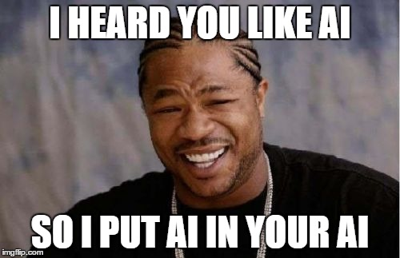

It's been more than a year since I last talked about [Clean Space](http://blog.devbot.net/clean-space-game/), so I wanted to throw out this (lengthy!) post with a bit of a status update, as well as talk about something I'm working on with regards to *Clean Space* that others might find interesting. So there's the first bit of information - work on *Clean Space* continues. Not as actively as I would like, but I have to balance *work* and *living*.

_Sensor Projection of Unidentified Vessel `MTRD-4482`_
{: style="font-size: 12px; text-align: center;"}

I won't say the game has come on leaps and bounds, it really hasn't. I spent a long time getting annoyed at game frameworks for having truly awful APIs, even forked MonoGame twice to give it a decent Game Loop, DI and an eventing backbone before giving up on the framework completely (*I actually have an incomplete blog post about this which I can go back and complete if someone expresses some interest*). My current plan is to use [ThreeJS](https://threejs.org/) which looks plenty capable, and supports the web application model required by the massively intensive processing requirements of certain game aspects.

## Artificial Intelligence

If you have a better memory than I, you might recall 12-18 months ago that I explained how comprehensive the AI in *Clean Space* would be. The goal was "simple", *every* single thing a Human would be able to do in-game, an AI would also be able to do, and vice versa. The AI(s) would have no more game state made available to it than a player, and [*perspective*](http://blog.devbot.net/clean-space-game/#perspective) would be forced upon player and AI alike.

A lot of AI-like player can, and often is implemented in the form of numerous rules that react to events. However, because I'm apparently glutton for punishment, and as the title of this article probably gave away, I'm not taking the easy way out. Instead, I'm using as close to real artificial intelligence as I can get, which means neural networks and deep learning.

## Goals

The high level goals of Clean Space have never changed.

- I want a game that *I* want to play. If anyone else happens to enjoy it too, great. If I can make enough money from it to pay server costs, awesome. If I can make enough money from it to buy a GTR... one can dream.
- I want to learn a metric sh*t tonne. There are so many aspects to this game that it's literally impossible for any single person to know them all; I want exposure to as much of that as I can.
- I want to set an example. I wrote an article some time ago about how I feel about the [Game Industry](http://blog.devbot.net/industry/). The software industry as a whole isn't much better, but at least what's *exposed* of the Gaming side is pretty bad.

Clearly, meeting any kind of timescales is not an example I'll be setting. But I hope to provide some clean practices and perhaps frameworks, framework integration, and of course *Clean Engine*.

I haven't defined a specific *minimum viable product* for *Clean Space*, because despite the talk about money above, I don't care all too much if the game never releases. It'll come along when it's good and ready. But that does mean progressing towards smaller goals and trying to keep up with an ever-evolving game design.

In this article, I want to focus on AI and show how it contributes towards the bigger picture.

### Layers in your Layers

There are so many AI's required to fulfill my vision for *Clean Space*, that I'm going to have to name them for this to next section to make sense. I'll apologise in advance for constant interruptions to immersion as I explain how the AI vs Player mechanics would work.

So, let's start with a space craft, in a stellar system. I'm going to jump straight to the vehicle's AI and skip over all the AI involved in construction, crew allocation, objective creation and assignment, etc.

#### Engineering

The space craft has 2 primary propulsion units (main drives, or engines if you prefer). The Chief Engineer, in addition to maintaining everything, has been plotting the characteristics of each engine. She knows that every engine has it's own quirks, derived from the materials used, assembly quality, fuel purity, and so forth. These hidden variables no one but the game engine knows completely. But, by monitoring data that is available (temperatures, pressures, harmonics, specific impulse, acceleration curves, etc.) a skilled engineer will be able to predict to some degree of accuracy how the engines will behave when they're put to various uses in the future.

Personally, I'm not the kind of guy that would enjoy plotting this data in a spreadsheet and speculating as to the maths. I really hope one day that a niche within a *Clean Space Community* does attempt this though. I'd be fascinated as to how close they could get to the actual implementation, which I'll try to make complex and elusive enough so as to make it impossible to predict with 100% certainty. Players won't be *punished* for not undertaking these tasks themselves though, the AI will truly be the best I can make it. It won't have access to anything the player can't get hold of, so it will be working within a perspective without visibility of the myriad of hidden variables that actually drive the calculations, but predictive machine learning should be very useful here.

#### Astrogation

Constant revisions by the engineer are being fed into astrogation. There are many ways to get from A to B in space. In modern day technology we often see amazing trajectories like this one ([OSIRIS-REx](https://www.asteroidmission.org/)):

Ignoring that this trajectory isn't intended to get from A-B per se, it does make for a good example of how modern day space flight paths rely on very limited specific impulse and delta-v. Given *Clean Space* works with more futuristic technologies and much lowered constraints, getting from A-B doesn't need to follow these spectactular orbital trajectories.

As such, there are several flight profiles available to an astrogator, which in turn were derived from machine learning, not pure unadulterated maths. The astrogator is responsible for feeding space craft characteristics such as mass, and the engineer's recommendations for drive profiles, and then teaching her machine learning algorithms how to plot a course. Profiles might be trained by rewarding the conservation of fuel or time, reduction of strain on equipment, accuracy of target orbit, accuracy meeting a target rendevous epoch, or whichever reward weights the astrogator chooses. Ultimately, the astrogator is trying to prepare her toolbelt so that no matter where the Captain wants to go and how they want to get there, the astrogator is ready to make that happen.

Processing time won't be unlimited, so prioritising which profiles are trained best and kept up to date will require the astrogator to understand the Captain's objectives and whims.

In-flight, the astrogator will also need to account for impromptu equipment failures and disparity between predicted and actual drive profiles, not to mention may not have all necessary orbital data to have correctly accounted for relativistic effects, so will need to be able to compensate and adapt.

#### Captain

*Clean Space* is about as *sandbox, open-world* as you can get. But, whilst you *can* do anything you want, that doesn't mean you'll be *rewarded* for doing so. Planets and Governments are trying to balance a huge number of responsiblities such as economics and security. There is no magic cash cow in *Clean Space* that swings a wand and introduces money into the economy everytime you shoot a magically spawned pirate space craft. That money has to come from *somewhere* (as would the pirate...).

Captain's will have spent ample time learning other trades and have a good understanding of roles available to space craft. Which role the captain and vehicle fill will be a matter of preference and supply & demand. Not *everyone* can be a Military Captain if there is insufficient drive for security - the government will reduce the budget and the admiralty will reduce expenditure (including rewards), effectively prohibiting the expansion (or forcing a reduction in) Military capable vehicles.

The game engine will attempt to balance player short falls by introducing AI to fulfill roles players don't want, but if there is no demand for a role, a player is going to have an all but impossible time filling said role.

As such, the Captain in our above scenario has objectives, some kind of role they understand and know how to be rewarded. The Captain has to rely upon all the other layers of AI above in order to fulfill those objectives, for example, as Search & Rescue, plotting a least time course to a vehicle in distress in order to collect a reward from the distressed space craft's insurer or be compensated by the government for that role. Or, as a gargantuan hauler moving materials between ore processing plants and refined material factories.

Whatever the purpose, whether the Captain is played by an actual human or an AI, it's unavoidable that somewhere along the chain, they'll be reliant upon AI. Layers of them!

