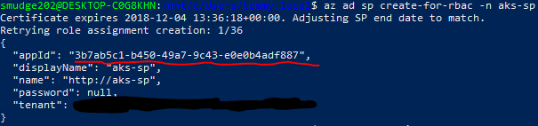
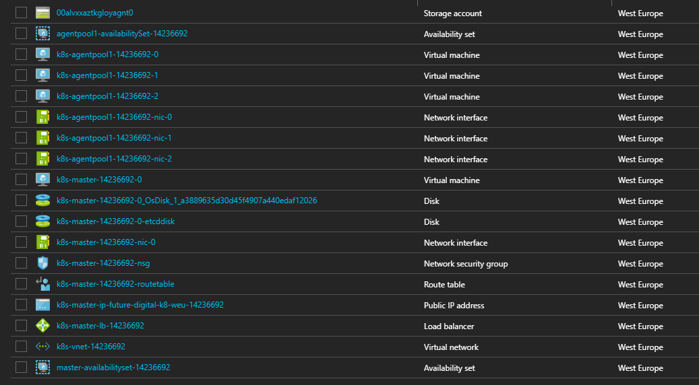

There has been a lot of movement around kubernetes (k8s) of late. Several big name vendors have [assumed k8s as the de facto standard](https://techcrunch.com/2017/09/20/kubernetes-gains-momentum-as-big-name-vendors-join-cloud-native-computing-foundation/), and all the big name cloud providers now have some level of integration. I work at an Azure house (though we have a good chunk in AWS also) so we had been looking forward to getting involved with the [new Azure Container Service](https://azure.microsoft.com/en-gb/blog/introducing-azure-container-service-aks-managed-kubernetes-and-azure-container-registry-geo-replication/). However, the service (still in preview at time of writing) is far from ready. The myriad of bugs we encountered have lead us to deploying our own cluster in Azure to learn more about the procedure and technologies. We anticipate switching back to the managed service when we deem it to be ready, but for now I want to walk you along the journey we've taken in case you too would prefer the more hands on approach.

## Azure Containers

For the time being, there are two versions of Azure Container Services. The original, publicly available and stable variant which adopted the acronym *ACS* as you would expect, though I believe is now referred to as [Container Instances](https://azure.microsoft.com/en-gb/services/container-instances/).

I took part in evaluating this service for my company at the time (several months ago), and decided the orchestration mechanics were lacking. Whilst it achieves the goal of running and scaling docker instances and load balancing them, there really wasn't any other orchestration features available, and given the implementation seemed to be bespoke to Azure, extending the base featureset doesn't appear to be viable.

The new Azure Container Service (AKS - the 'K' presumably denoting it's Kubernetes integration) will, I'm sure, be a fantastic offering once it's feature complete and stable. The premise of the service is that Azure will front the cost of the management nodes for you (utilising recently added k8s features that allows Azure to manage many clusters from their controllers).

However, the problems we encountered over a brief period:

* Whilst provisioning a *default* cluster is incredibly simple, customising it to any real degree is difficult, and often not possible at all (depending on level of customisation required).
* Once provisioned, you don't appear to be able to change much of the cluster configuration (node count, VM size, etc.).
* The cheapest VM you can run nodes on is restricted to a *Standard D2 v2* when provisioning through AKS, so if you go with the default of 3 nodes, costs ~£220 p/month
  * *This was a big deal for me; anything that falls outside ~£110 p/month means either massive teardown overhead or simply not being able to test and learn a tech using my MSDN Enterprise Azure Credits.*

Fortunately, the AKS service is built upon the open-source [ACS Engine](https://github.com/Azure/acs-engine), which can be used standalone to produce the exact same mechanisms in a much more customisable manner. Personally, I also prefer this mechanism because the innards are not hidden away behind a featureless *Container Service* - instead you can see each VM, availability set, NSG, IP, NIC, etc.

## ACS Engine

The ACS engine isn't documented perfectly yet, but it's certainly workable. My aim was to provision a multi-node cluster that met my cost requirements (£110 p/month) whilst providing all the features possible for me to play with.

The following is a walkthrough on how to get setup. The steps can be completed on Linux or Windows, through Powershell or Bash. To where you install the pre-requisites will determine where you run the remaining steps.

### Prerequisites

* Install [Azure CLI 2.0](https://docs.microsoft.com/en-us/cli/azure/install-azure-cli?view=azure-cli-latest)
* Install [Kubectl](https://kubernetes.io/docs/tasks/tools/install-kubectl/)

### Getting Started

For the most part, I followed the *ACS Engine* advice on how to install the [long way](https://github.com/Azure/acs-engine/blob/master/docs/kubernetes/deploy.md#acs-engine-the-long-way). Following the simple `acs engine deploy` mechanism will create all the components the normal AKS service would have done with little customisation (though at least not hidden behind the abstract service).

In order to attain greater flexibility, you'll want to follow this slightly lengthier process:

#### 1. Login

Open your choice of shell and get yourself logged into the Azure CLI.

```shell
az login
```

This will typically result in a short trip to the specified URL where you'll need to enter the code displayed in the shell.

#### 2. Resource Group

You'll want to create a resource group to contain all the moving pieces (there are quite a large number). Here I'm creating a resource group called `furture-digital-aks` in West Europe.

```shell
az group create -l westeurope -n future-digital-aks
```

#### 3. Key Vault

Key Vault will be used to store the credentials for your service principal, which in turn is responsible for managing your azure resources in accordance with Kubernetes requirements. You can skip key vault and use plain old credentials if you prefer.

This command will create a key vault called `future-digital-aks-kv` in the resource group we just created, again, located in West Europe (I recommend keeping related resources co-located!). I've also enabled all the features - as far as I know, it doesn't cost to have them enabled and you never know when they might come in handy.

```shell
az keyvault create -n future-digital-aks-kv -g future-digital-aks --enable-soft-delete true --enabled-for-deployment true --enabled-for-disk-encryption true --enabled-for-template-deployment true -l westeurope
```

#### 4. Certificate

With key vault available, I now need to create a certificate for our service principal to use. Nothing fancy here, simple create a certificate called `aks-sp-cert` using the default cert policy.

```shell
az keyvault certificate create --vault-name future-digital-kv -n aks-sp-cert -p "$(az keyvault certificate get-default-policy)"
```

#### 5. Service Principal

With the certificate ready, we can create our service principal. In this example, I've scoped the service principal so that it only has it's default role of `Contributor` within our newly created resource group and named it `aks`. Notice we provide the name of the certificate created in the previous step, `aks-sp-cert`, and provide details for the key vault created.

```shell
az ad sp create-for-rbac -n aks --scopes /subscriptions/<YOUR SUBSCRIPTION ID>/resourceGroups/future-digital-aks --cert aks-sp-cert --keyvault future-digital-kv
```

**Important**: take note of the `appId` in the response to this command, you will need it later.



> **Note**: *You'll need to input your own subscription ID if you want to scope this service principal. Alternatively, you can remove the `--scope` switch if you prefer.*

#### 6. SSH Key Pair

The virtual machines created for the cluster will be running on Linux, which means any administration required on the boxes directly will require [SSH](https://en.wikipedia.org/wiki/Secure_Shell). *ACS Engine* will setup your machines for SSH, but in order for you to connect you will need to create an SSH Keypair. There are several ways to accomplish this, but from bash (available in Powershell if you're using [WSL in Windows 10](https://msdn.microsoft.com/en-gb/commandline/wsl/about)), I used the following:

##### 6.1. Create Private Key

```shell
ssh-keygen -C "your@email.com"
```

By default, this will create a 4096-bit RSA key, which should be perfectly sufficient. You will be prompted as to where the generated key should be stored (`~/.ssh/id_rsa` by default) and what keyphrase/password to use.

##### 6.2 Export Public Key

```shell
ssh-keygen -e -f ~/.ssh/id_rsa.pub
```

This will create an `id_rsa.pub` file containing your public key in the default `RFC4716` format (you can use `-m` to specify alternative formats ike `PKCS8` and `PEM` should other tooling require such).

You can simply use `cat ~/.ssh/id_rsa.pub` to display the contents of the public key file which can be copied elsewhere as required.

> **Note**: *You'll need this exported public key in the next step.*

#### 7. Cluster Definition

We have now prepared all the resources we require to get a cluster up and running. The next step is to create/modify a cluster definition for the *ACS Engine*. You can find the [default example here](https://github.com/Azure/acs-engine/blob/master/examples/kubernetes.json) or you're welcome to work from the one I'm using in this example:

```json
{
    "apiVersion": "vlabs",
    "properties": {
        "orchestratorProfile": {
            "orchestratorType": "Kubernetes"
        },
        "masterProfile": {
            "count": 1,
            "dnsPrefix": "future-digital-k8-weu",
            "vmSize": "Standard_B2s"
        },
        "agentPoolProfiles": [
            {
                "name": "agentpool1",
                "count": 3,
                "vmSize": "Standard_B1s",
                "availabilityProfile": "AvailabilitySet"
            }
        ],
        "linuxProfile": {
            "adminUsername": "azureuser",
            "ssh": {
                "publicKeys": [
                    {
                        "keyData": "ssh-rsa AAAAB3N...<snipped>...@futuredigital.co.uk"
                    }
                ]
            }
        },
        "servicePrincipalProfile": {
            "clientId": "3b7ab5c1-b450-49a7-9c43-e0e0b4adf887",
            "secret": "aks-sp-cert"
        }
    }
}
```

> **Note**: *You must choose your own custom `dnsPrefix` within the `masterProfile` segment.*

You'll need to inject several pieces of information into the json that you'll have gathered over the previous steps:

* `properties.linuxProfile.ssh.publicKeys.keyData` - this is where the public key from [6.2 Export Public Key](#62-export-public-key) needs to go.
* `properties.servicePrincipalProfile.clientId` - this is where you put the `appId` from [5. Service Principal](#5-service-principal).
* `properties.servicePrincipalProfile.secret` - simply insert the *name* of the certificate created for the service principal.

You can from here adjust master and node VM sizes and counts, and set your own linux user name if you prefer.

#### 8. Generate Templates

We will now instruct the *ACS Engine* to generate an Azure Resource Management template for us to deploy. This step will simply create the json required for our deployment, which you can futher edit if you so wish:

```shell
acs-engine generate path/to/kubernetes.json
```

The command will create an `_output` directory which will contain a directory matching your `dnsPrefix`. Inside here are all the ARM template files.

#### 9. Deploy Template

Once you're satisfied with the ARM template, simply deploy to azure:

```shell
az group deployment create -n aks-deployment -g future-digital-aks --template-file .\_output\your-dns-prefix\azuredeploy.json --parameters .\_output\your-dns-prefix\azuredeploy.parameters.json
```

This will take quite a while to execute, but once complete, you should have an AKS cluster something like the following



## Next Steps

I recommend checking out this [Kubernetes Walkthrough](https://github.com/Azure/acs-engine/blob/master/docs/kubernetes/walkthrough.md).