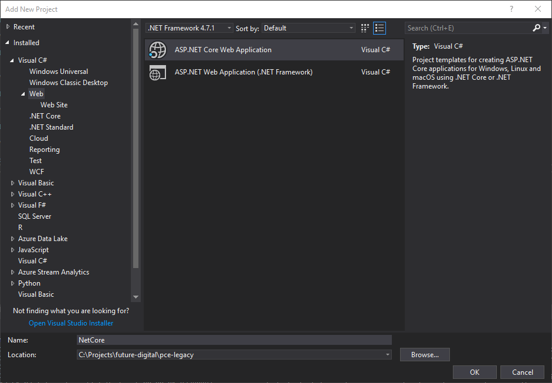

I recently started work for a [new (and very exciting) company](http://www.futuredigital.co.uk/). Like many of my previous roles, this one entails a good mix of [*Brownfield*](http://en.wikipedia.org/wiki/Brownfield_(software_development)) and [*Greenfield*](http://en.wikipedia.org/wiki/Greenfield_project) development. I've met and worked with some great developers who would outright refuse roles that held too much Brownfield work, preferring pastures green, as well as working with some great devs that prefer the challenge of Brownfield.


_Image from [Virtual Geek](http://virtualgeek.typepad.com/virtual_geek/2015/08/vmworld-2015-cloud-native-apps-a-complex-interesting-but-fascinating-story.html)_
{: style="font-size: 12px; text-align: center;"}

Having worked with the key *.Net* web technologies, I'd like to put to paper and potentially pass on, by way of this article, some insights into Brownfield development (plus invite comment on further insights and improvements on these techniques).

<!-- markdownlint-disable MD007 -->
<!-- markdownlint-disable MD010 -->
<!-- TOC -->

- [Estate](#estate)
  - [Tact](#tact)
  - [Mining](#mining)
- [Goal](#goal)
  - [Top-Down](#top-down)
  - [Bottom-Up](#bottom-up)
- [Migration](#migration)
  - [ASP Classic](#asp-classic)
  - [Web Forms](#web-forms)
  - [MVC](#mvc)
- [Techniques](#techniques)
  - [Sideloading](#sideloading)
    - [Web Forms to MVC 5](#web-forms-to-mvc-5)
      - [Move Web Forms into MVC 5](#move-web-forms-into-mvc-5)
      - [Move MVC 5 into Web Forms](#move-mvc-5-into-web-forms)
    - [Full-Fat .Net Core](#full-fat-net-core)
  - [Proxy](#proxy)
- [Testing](#testing)
  - [Pre Request Handler](#pre-request-handler)

<!-- /TOC -->
<!-- markdownlint-enable MD007 -->
<!-- markdownlint-enable MD010 -->

## Estate

My past few roles have entailed a large amount of what we'll fondly refer to as *heritage* software. Whenever tackling these code bases, my first task towards orchestrating the migration or uplifting of heritage software is establishing the *estate*.

Most of the legacy code I've inherited throughout my career was being maintained by developers that were not around for the entire history of the software. Oftentimes you'll be working with developers long since devoid of the original authors and left with little more than speculation and grey area, but your number one job is to understand the functionality of the software suite.

I don't aim to know how it works, and as amusing or aggravating as the *why-it-works-that-way* might be, that isn't necessarily of importance either.

### Tact

Those that know me well probably wouldn't use the word "tact" in the same sentence as my name. Bad code **really** gripes me and it's not uncommon for my mouth to move before my brain catches up. In closed company this can be a great stress relief, and I've no problem with anonymous/redacted submissions to [The Daily WTF](https://thedailywtf.com), but putting people's backs up doesn't help.


_Image from [Quick Meme](http://www.quickmeme.com/)_
{: style="font-size: 12px; text-align: center;"}

Having hurt several people's feelings in the past saying the first angry thing that came to mind after seeing a snippet of... *interesting* code, I've had to lay some ground rules for myself that others may benefit from.

- Presume that the bizarre and downright crazy code you come across was driven by one reason or another that you simply can't comprehend, and the inability to comprehend it is *your* shortcoming.
- Accept that decisions were made with constraints you can't fathom, and there's little that whining about it will do to change a thing.

I'm a big fan of of this quote

> *"Always code as if the person who ends up maintaining your code is a violent psychopath who knows where you live." - [John Wood (probably?)](https://stackoverflow.com/questions/876089/who-wrote-this-programing-saying-always-code-as-if-the-guy-who-ends-up-maintai)*

...but in all likelihood, the developers who wrote the software didn't hear that advice.

There are only two real ways I've found to establish an estate. The first and most preferable is through the experience of others. Asking questions starting at high level design, digging down as necessary, but making an effort not to point fingers. If the people answering my questions are not aware how bad (I think) their code is, I'd rather teach them by example; through excited demonstrations of good software at a later date, **not** by shaming them in the present.

### Mining

Alongside gaining information from peers that may have been around longer than me, or in the complete absence of such, I also dig through code. Of course, the first thing I do is go looking for an up to date and comprehensive test suite... one day that might even pan out for me. More likely though, you'll jump to a test project to find empty, redundant, commented-out, superfluous blocks of code.

My preferred approach when I don't have tests is to establish the public endpoints. What is the customer facing surface area of the product? What are the common interactions? How does the code accomplish these tasks? What services, API calls, database logic and so forth is required to achieve the most basic and most common aspects?

I don't try to memorise and graph everything; take notes and update any documentation that proved to be incorrect, but at this stage you just need to get a feel for how the thing hangs together.

## Goal

You might think that this section should have come earlier. But actually, the establishing of one's estate is something I'd begin on day 1 of any role, regardless of overarching objectives.

I'm not sure if we're seeing a shift in the industry or if I've just been lucky, but my last several CTO's/managers valued intelligent, self-managing autonomous teams. They provided high level goals and appropriate deadlines with little else, preferring that the team determine the best courses of action.

If your managers aren't quite as cool though, there's still some tips below, especially in the [Bottom-Up Section](#bottom-up).

### Top-Down

> Note: *I've noticed that I don't always agree with which way round "top-down" and "bottom-up" describes these mechanisms. I'll describe them as I visualise them in my head, but be aware I (or others) may use the inverse!*

Knowing what the product does, having established the estate, albeit not including all the nuances and finer detail, how would I write the product from scratch? As a team, draft and design, at a high level, what that system would look like. What tech stacks would you be looking at, what architecture, what deployment infrastructure, security, resilience, and so forth, would be built in?

This *ideal* system, subject to change as requirements are deduced and refined, is now my goal. The question becomes, how do you *iteratively* arrive at that goal.

In the past I've worked for a couple of companies that had decided that the only way to migrate their product, was a complete re-write. At the time, this meant more interesting code writing for me, so who was I to complain. However, one company was writing a new web product in parallel with maintenance on a thick WinForms product. I don't know if they ever got there, but I had the distinct impression that there was simply no way for the new product to catch up with the old.

Another company I worked for had been through THREE attempts to re-write their software. Each had ended when cash or motivation for the cycle ran dry and the re-write was scrapped in favour of the much more stable and feature-full original legacy software. By the time I joined said company, they had bought all of their users a second monitor so that everyone could run new and old systems at the same time - entering data into both systems for every operation.


_Image from Uncyclopedia Wiki_ {: style="font-size: 12px; text-align: center;"}

The point being, if your plan is to *File -> New Solution* and one day flick a switch, chances are you're doomed to failure. I've heard in passing from proud CTO's where such an endeavour has paid off, but it is a massive and *unnecessary* gamble. By and large, all you'll achieve is the creation of an incomplete product fork that is shelved when the cash runs out, or is forced into the wilderness despite reduced and unfinished functionality, causing your users no end of pain.

Therefore, the trick becomes, how do you get from A → B. I try to define phases, often utilising one of the [techniques below](#techniques) as a starting point, then iteratively adding my *ideal* infrastructure in phases that get me from the current code base to the end goal. Whilst that's quite an abstract description of this process, each system will need to be assessed on a case by case basis.

Some objectives I try to maintain whilst defining these phases may be of help:

- Avoid downtime
  - Especially when using the [proxy technique](#proxy) described later in this article, it's quite often possible to roll over to new infrastructure at the speed a DNS change propagates without incurring any downtime at all. In the case of upgrades to necessitate [sideloading](#sideloading) however, the best bet is often to coincide changes with a scheduled release.
- Improve visibility
  - Along every step of the way, I try to improve the logs and analytics available to me. I know that speculation and even *educated* guesswork is still exactly that, guesswork.
- Maintain reverse compatibility
  - As heritage components are exchanged out, I do what I can to accommodate existing users. Legacy API surfaces typically don't have any [versioning mechanisms](https://www.hanselman.com/blog/ASPNETCoreRESTfulWebAPIVersioningMadeEasy.aspx) so treat your existing estate as `v1` implicitly, and build `v2` upon it, using metrics and logs to determine when aspects of the heritage system can safely be disabled and removed.
- Clean up orphaned work
  - As components are deprecated and replaced, it's important to remember to go back and delete the respective code. Many a time I've stumbled across orphaned code but lacking the context that the functionality was recently replaced, the decision to remove the code is much trickier!

### Bottom-Up

I've worked for several companies where terms like *"migration"* and *"re-write"* were too big and scary to be even uttered. Companies where product owners, line management, top bods, or all of the above were against the idea of improving the software for one reason or another. Sometimes it's worth fighting with them over it; perhaps it's just a fear of the unknown which can be alleviated, or a misunderstanding of what's involved.

But when all else fails, I always fall back on the *bottom-up* approach. For those familiar with the [boyscout rule](https://books.google.co.uk/books?id=_i6bDeoCQzsC&pg=PA14&lpg=PA14#v=onepage&q&f=false), the bottom-up migration is little more than a slight extension of that. More often than not, I've found it's just about drawing lines a little further in the sand.

I've often found that these roles follow *Panic*-Driven-Development (PDD), placing themselves in an endless vicious cycle of fire fighting the latest problem as quickly as possible, foregoing clean coding principles. Many a time I've seen this equally-endlessly described as a *temporary* measure, but of course, foregoing good practices in code inevitably leading to more fires to that need putting out, increasing code complexity from hack after hack further slowing down the ability to maintain the software.

The way out of this loop, I've found, is to move the line in the sand. Step up your boy-scouting from removing unused variables and correcting member casing, to writing tests. Using one of the [testing practices](#testing) explained below, I'm often able to get dependency injection and mocking into even the worst of code bases.

Once you've established a testing practice (remembering to onboard and help peers to do the same), step it up to the next level. Keep improving upon the worst areas, driven by customer demand typically, though evaluation of technical debt where time permits. With this approach, I find you end up in a *hybrid* state for longer than is the case with *top-down*, but if your focus is on addressing problem areas, presumably any lingering legacy code isn't causing you a great deal of harm.

In that respect, this approach, while not my preference, can be more palatable to stakeholders. Better yet, you don't need any *permission* or *sign-off*.

Instead of saying to my product owner

> *"If I do it **properly** it'll take this long, but I can hack it in much quicker if needs be*

...I only offer them estimates based on my line in the sand. I've found there needs to be a pragmatic vs. dogmatic balance mind you. If you leave your product owner or stakeholders in a bind, you may be doing more harm than good to your company, no matter your intentions. More often than not there's a middle ground that both sides can compromise and agree upon, though try not to be pushed too far back from that mythical line in the sand.

I've usually found this to be an arduous and lengthy process, but as confidence in the software increases due to a reducing number of bugs, confidence in the development team increases alongside it. If the doors were closed on a top-down approach before, you may find them increasingly ajar as confidence improves.

## Migration

Having established the estate, determined a preferred migration methodology, and put together some flexible high level phases that will get us to our goal, the really tough part begins. How to get there?

I'm going to list a few titbits I've picked up over the years, including code samples, where applicable, that may help you achieve your ends. These particular code samples will be focused on the web stack, but I've had experience with WinForms, WPF, UWP (desktop based) technologies so if you'd like some advice there, ping me a comment and I'll draft up some notes.

If you have something specific in mind, feel free to jump to the section below that best describes where you are right now.

### ASP Classic

I haven't had to do this for a long while, but traditionally, facts are we're running outside of .Net, and almost certainly on an outdated version of IIS and/or on bare metal. Options here really are very limited and dependent on circumstances, but my advice would be:

- If there is an IIS version that can side load both the ASP Classic site(s) and a .Net site, I'll attempt to follow the [Proxy](#proxy) section below.
- If the site(s) are addressed by DNS instead of by IP directly, I can still try the [Proxy](#proxy) methodology.
- If the site is addressed directly, and/or the site relies on some crazy old undocumented and unsupported `dll`, inevitably I've ended up having to replace some components en masse. However, still check out the [Testing](#testing) sections below for some advice on how to do so more safely.

### Web Forms

As a technology, I consider *ASP .Net Web Forms* to be worse than ASP Classic. The bastardisation of HTTP to better suit desktop minded developers, whilst a viable *developer* migration strategy for Microsoft, was in all other respects a mistake. ASP Classic is at least not all that different from *"modern"* scripting languages such as PHP, which whilst I might not have any fondness for either, still have their uses.

I recommend checking out existing articles such as [Rachel Appel's guide](http://rachelappel.com/integrating-aspnet-web-forms-and-aspnetmvc/) or check out my own advice in the [WebForms to MVC section below](#web-forms-to-mvc-5) for a guide on sideloading Web Forms and MVC. This allows the introduction of MVC mechanisms into an existing web application.

Once the infrastructure is in place, I make it a rule that all new work should be completed using the MVC architecture, and whenever a significant amount of work is required within an existing Web Form, I consider moving the code to MVC instead (bearing in mind aforementioned pragmatic/dogmatic caveat).

I'm not going to argue or even make a case for the merits of migrating from WebForms to MVC; I'd just end up ranting. Apart from my deepfelt resentment for the WebForms stack, the benefits of MVC over Web Forms are very easy to google for.

Once MVC side loading is in place, check out the [Testing](#testing) section below for tips on how to more safely migrate heritage code.

### MVC

I've been working with the *.Net Core* stack since it was still called *"Project K"* (so, a few years now). Whilst I'm more inclined to harp on about why and exactly how *.Net Core* is better, I'll try not to. However, I do consider it a *huge* improvement over class/full-fat MVC (let alone Web Forms), and recommend it to others.

If you check out the section below on [Full-Fat .Net Core](#full-fat-net-core), you may find it's easier to get into than you imagined.

## Techniques

There are two key techniques I use and recommend to others when it comes to migrating a code base. They each have their own pros & cons, and the best choice will be determined by your circumstances.

All techniques assume you're using some kind of version control and if everything goes wrong, you can just back out and start over. If you're not using version control and mess things up, I'll lose no sleep over your lack of forethought.

### Sideloading

This involves running both old and new technology stacks in the same application. It won't apply to *ASP Classic*, but for later technologies, check out the following sections for examples on how to do this.

#### Web Forms to MVC 5

There are already some great guides out there on how to sideload so I won't provide all the details here, they haven't really changed that much between the MVC versions. It's important to note that this is a migration to the *"full fat"* ASP .Net framework and has nothing at all to do with *.Net Core*.

There are two ways to perform the migration as detailed below. Neither is necessarily *better*, but if you find yourself stuck trying one option, simply shelve/revert your changes and try the other option.

Regardless which option you go with, you'll need to ensure your Web Forms application is targeting a supported version of *.Net*.

> Note: If you're still targeting *.Net 4.5.1* or lower, you're using an [unsupported *.Net* version](https://blogs.msdn.microsoft.com/dotnet/2015/12/09/support-ending-for-the-net-framework-4-4-5-and-4-5-1/), so get yourself updated.

These infrastructural changes can be a nightmare to test if you don't have a reliable test suite. There is no *silver bullet* if you don't have tests; you're going to need to set yourself up a replica of your Production server and make sure the upgraded version performs as expected the hard way (manual testing). For what it's worth, whilst I have encountered issues post-migration, they've always been immediately obvious (errors on startup) and easy to google a resolution to. It'll be tedious, but if your google-foo is strong, rarely more than a day or two of effort at least getting everything up and running.

##### Move Web Forms into MVC 5

In this approach, we'll create a new MVC 5 project and move our existing code over.

1. Open one of the code files in the Web Forms project (doesn't matter which).
1. Add a random (valid, but unused) `using` statement (unless there are already greyed out `using` statements present).
   - For example, if it's not present already, add `using System.Web.Globalization;`
1. Now, with the caret on the unused `using` (which should be showing as greyed out if you're using a modern Visual Studio), press `Ctrl + . (period)`, mouse over `Remove Unnecessary Usings` and then click `Solution`:

    

    This will come in very useful later if you haven't been cleaning up your `using`s before now.

    > Caveat: Visual Studio can be a little *cavalier* when determining whether a `using` is in use or not. Especially if you have any imports inside `aspx`/`asmx`/`ascx` files. Make sure you review your changes, that your project still builds, and that your views still render. Typically, opening any file modified will cause static analysis to kick in - if it starts showing exceptions, then add the necessary imports back.

1. Create a new MVC 5 Project.
1. When prompted, ensure you enable Web Forms and MVC (and Web API if you will need it):

    

1. Navigate to your Web Forms project in Windows Explorer, and copy all of the files (and folders) to your New Project, except those listed below. If prompted, skip any files about replacements and take note of which files couldn't be copied.
   - `bin\`
   - `obj\`
   - `Properties\`
   - `Connect Services\`
   - `*.csproj`
   - `global.asax`
   - `global.asax.cs`
   - `web.config`
1. In Visual Studio, select your MVC project in *Solution Explorer* and select *Show All Files*:

    

1. If you expand your MVC project, in addition to the default MVC infrastructure generated during project creation, you should be able to see all your pages, controls, and so forth, copied over from the Web Forms project. You need to work through all these files, R-Click them and choose `Include in Project`. You can highlight several at a time and include whole folders to make it easier.

    

1. Merge the Web Forms `global.asax` into your new MVC 5 `global.asax`
   - This should be no different to any other code merge. MVC 5 will only be using the `Application_Start` event currently, so copy over any custom code you have in the old `global.asax` being careful not to remove the MVC 5 logic.
1. Merge the Web Forms `web.config` into your new MVC 5 `web.config`
   - This is much trickier because there will often be a considerable difference between the configs. You'll need to not only copy over the obvious items like `appSettings` and `connectionStrings`, but also ensure required `HttpModules`, security and runtime settings, WCF bindings, and anything else your Web Forms project *actually* needed is copied over. If you start with the basics, you can then just keep trying to load your new site, resolving startup errors by copying over the respective old configuration (you may need to come back to this task after you've got the new project compiling).
1. Merge over all the files you took note of in *Step 6*.
1. Try to build your new MVC project. The likelihood is that it will fail because references included in your old project have not yet been added to the MVC project.
   - Run a build and then examine your `Error List`, ensuring that you've selected `Build Only` in the drop down (Intellisense can generate thousands of errors when a reference is missing, creating a lot of confusing noise).
   - The errors you find will almost always be a difference in references between old and new projects. In the file with an exception, take a look at what Visual Studio thinks is an unused or missing `using` statement (which we know shouldn't exist now because we removed them all earlier) at the top of the file, and add a reference to the respective assembly. The name of the `using` should give a good indication as to which assembly you're missing, otherwise lookup one of the classes that cannot be resolved on MSDN; the page will tell you exactly which assembly contains the given class.
   - Any errors you can't fix by adding a reference to the necessary assembly, take to google.
1. Make sure your views actually compile. Either open each of the views to see what intellisense finds, or publish the site with [Precompilation enabled](https://docs.microsoft.com/en-us/aspnet/web-forms/overview/older-versions-getting-started/deploying-web-site-projects/precompiling-your-website-cs) to ensure the views haven't been broken.
    - For whatever reason, the static analysis that identifies problems in your `*.cs` files doesn't scan your views so this form of precompilation can be useful to locate errors that static analysis misses and would otherwise cause you a runtime exception.

Congratulations, with a little bit of luck you've now got your project sideloading. Feel free to drop me a comment if you get stuck and can't find an answer on google.

Next steps, you can either look at the [Testing](#testing) section for advice on how to replace those pesky Web Forms files, or if you've managed to achieve that, check out the section below on [migrating to .Net core](#full-fat-net-core).

##### Move MVC 5 into Web Forms

With this approach, we'll try to uplift an existing Web Forms project to include the necessary MVC 5 infrastructure. Before you start, I recommend creating a new (temporary) MVC 5 web application that has both Web Forms and MVC enabled so that you have an easy-to-reach example project to check if you're unsure about something.

1. Install the [`Microsoft.AspNet.Mvc` NuGet Package](https://www.nuget.org/packages/microsoft.aspnet.mvc)
1. Add the following `configuration/appSettings` in `web.config`:

    ```xml
    <appSettings>
      <add key="webpages:Version" value="3.0.0.0"/>
      <add key="webpages:Enabled" value="false"/>
      <add key="PreserveLoginUrl" value="true"/>
      <add key="ClientValidationEnabled" value="true"/>
      <add key="UnobtrusiveJavaScriptEnabled" value="true"/>
    </appSettings>
    ```

1. Add the following section under `configuration/system.web` in `web.config`:

    ```xml
    <pages>
      <namespaces>
        <add namespace="System.Web.Helpers"/>
        <add namespace="System.Web.Mvc"/>
        <add namespace="System.Web.Mvc.Ajax"/>
        <add namespace="System.Web.Mvc.Html"/>
        <add namespace="System.Web.Routing"/>
        <add namespace="System.Web.WebPages"/>
      </namespaces>
    </pages>
    ```

1. Add a directory called `App_Start`
1. Add a class called `RouteConfig` to the `App_Start` directory, with the following content (update the Namespace accordingly):

    ```csharp
    using System.Web.Mvc;
    using System.Web.Routing;

    namespace $Namespace$
    {
      public class RouteConfig
      {
        public static void RegisterRoutes(RouteCollection routes)
        {
          routes.IgnoreRoute("{resource}.axd/{*pathInfo}");
          routes.MapRoute(
            name: "Default",
            url: "{controller}/{action}/{id}",
            defaults: new { controller = "Home", action = "Index", id = UrlParameter.Optional     }
          );
        }
      }
    }
    ```

1. Add the following lines to the `Application_Start` event in `global.asax`:

    ```csharp
    AreaRegistration.RegisterAllAreas();
    RouteConfig.RegisterRoutes(RouteTable.Routes);
    ```

    > Note: You'll need the following `using` statements if not present:
    >
    >```csharp
    >using System;
    >using System.Web;
    >using System.Web.Mvc;
    >using System.Web.Routing;
    >```

1. Add the following directories to the solution:
   - `Controllers`
   - `Models`
   - `Views`
1. Add a *second* `web.config` to the `Views` directory, with the following content:

    ```xml
    <?xml version="1.0"?>

    <configuration>
      <configSections>
        <sectionGroup name="system.web.webPages.razor"     type="System.Web.WebPages.Razor.Configuration.RazorWebSectionGroup,     System.Web.WebPages.Razor, Version=3.0.0.0, Culture=neutral,     PublicKeyToken=31BF3856AD364E35">
          <section name="host" type="System.Web.WebPages.Razor.Configuration.HostSection,     System.Web.WebPages.Razor, Version=3.0.0.0, Culture=neutral,     PublicKeyToken=31BF3856AD364E35" requirePermission="false" />
          <section name="pages"     type="System.Web.WebPages.Razor.Configuration.RazorPagesSection,     System.Web.WebPages.Razor, Version=3.0.0.0, Culture=neutral,     PublicKeyToken=31BF3856AD364E35" requirePermission="false" />
        </sectionGroup>
      </configSections>

      <system.web.webPages.razor>
        <host factoryType="System.Web.Mvc.MvcWebRazorHostFactory, System.Web.Mvc,     Version=5.2.3.0, Culture=neutral, PublicKeyToken=31BF3856AD364E35" />
        <pages pageBaseType="System.Web.Mvc.WebViewPage">
          <namespaces>
            <add namespace="System.Web.Mvc" />
            <add namespace="System.Web.Mvc.Ajax" />
            <add namespace="System.Web.Mvc.Html" />
            <add namespace="System.Web.Routing" />
          </namespaces>
        </pages>
      </system.web.webPages.razor>

      <appSettings>
        <add key="webpages:Enabled" value="false" />
      </appSettings>

      <system.webServer>
        <handlers>
          <remove name="BlockViewHandler"/>
          <add name="BlockViewHandler" path="*" verb="*" preCondition="integratedMode"     type="System.Web.HttpNotFoundHandler" />
        </handlers>
      </system.webServer>

      <system.web>
        <compilation>
          <assemblies>
            <add assembly="System.Web.Mvc, Version=5.2.3.0, Culture=neutral,     PublicKeyToken=31BF3856AD364E35" />
          </assemblies>
        </compilation>
      </system.web>
    </configuration>
    ```

1. In this same *second* `web.config`, add your own namespace next to the `System.Web` namespaces under the `configuration/system.web.webPages.razor/pages/namespaces` section
   - For example, `<add namespace="Your.Namespace" />`

All being well, you should now have enabled MVC in your Web Forms project. To test everything is working, try [Adding a Controller](https://docs.microsoft.com/en-us/aspnet/mvc/overview/getting-started/introduction/adding-a-controller) and confirming you get a result.

Next steps, you can either look at the [Testing](#testing) section for advice on how to replace those pesky Web Forms files, or if you've managed to achieve that, check out the section below on [migrating to .Net core](#full-fat-net-core).

#### Full-Fat .Net Core

For developers that haven't jumped into *.Net Core* yet, I appreciate it can be a little daunting. A great deal has changed. You may have heard something along the lines of

> *".Net Core can run on the Full Framework"*

..but that probably doesn't make a great deal of sense. I don't really want to get into explaining the difference between platforms or what exactly *.Net Standard* is, so I recommend having a scan of [this article](https://docs.microsoft.com/en-us/dotnet/standard/net-standard) if you're unsure.

The point being, when people talk about *"Full Fat .Net Core"* what they're actually talking about is using the latest tooling such as the improved [`csproj` format](https://docs.microsoft.com/en-us/dotnet/core/tools/csproj) and *not* the cross-platform features introduced by *.Net Core* itself.

With that cleared up, you can very easily begin using the new tooling by targeting your new style `csproj` at the full *.Net Framework*:

```xml
<Project Sdk="Microsoft.NET.Sdk.Web">

  <PropertyGroup>
    <TargetFramework>net462</TargetFramework>
  </PropertyGroup>

  <ItemGroup>
    <Folder Include="wwwroot\" />
  </ItemGroup>

  <ItemGroup>
    <PackageReference Include="Microsoft.AspNetCore.All" Version="2.0.3" />
  </ItemGroup>

</Project>
```

These new style `csproj` files have gone the way of old school `web.config` and had a bunch of stuff hidden away so that, hopefully, only content that matters to you should be present. No longer will you find all the default build configuration and individual entries for each file in your project. Instead, the build configuration has some defaults tucked away (which can be overridden). For example, by default:

- All `*.cs` files are included and compiled
- All `*.resx` files are included and embedded
- All other files are shown in the project, but have no impact on the build

In addition to a cleaner `csproj`, you also get features like the [*transitive dependency*](https://www.erikheemskerk.nl/transitive-nuget-dependencies-net-core-got-your-back/) mechanism. When something is referenced, everything it references in turn is also pulled in, so instead of a `package.config` (which is no longer necessary) filled with dozens of packages despite you only having added 1 top-level package, you need only list the top level now.

*.Net Core* has a much higher release cadence than *.Net Framework*, so the associated tooling evolves quicker; it's likely worth your time [migrating to .Net Core](https://docs.microsoft.com/en-us/aspnet/core/migration/). You'll be rewarded with improved tooling, and you needn't change anything on your production server / deployment targets. Plus, it'll place you in a better position to migrate to the `.Net Core` *platform* should it's feature set entice you.

### Proxy

If [sideloading](#sideloading) isn't for you, there is an alternative. The idea here is to create a new web application which completely replaces your old website, but, by default, forwards all the requests to your old site (which is deployed elsewhere, in turn).

This of course introduces an additional web call and the associated latency which can be a deal breaker for many. But, if old and new site are physically co-located or sat in the same Cloud virtual network, you'll be surprised how small that latency is.

What you get in return for this latency is the ability to conditionally handle any request originally intended for your old site whilst using a new and improved technology stack, safe in the knowledge that anything you haven't decided to replace is being executed the way it used to.

Better still, Microsoft have already started writing the code necessary to do this very simply.

> Caveat: I'm going to reference the `dev` branch of an unpublished Microsoft GitHub repository in the following snippets because MS haven't officially published this anywhere yet - if that scares the snot out of you, you could always try writing it yourself... */sigh*
>
> In my opinion, better to use the existing code with no expectation of support, pushing useful changes back and testing the middleware for Microsoft than to write something homebrew.

I'm going to assume that you're using Git and the new site you're introducing is *.Net Core* (running on [full fat](#full-fat-net-core) if need be) because why wouldn't you? (Sure, because you want a mature EF, working SignalR, some other un-migrated dependency; all legit reasons).

1. Create a new *"ASP .NET Core Web Application"*

    

    - If you need to target *.Net Framework*, open the `csproj` and change the value of `<TargetFramework>` (i.e. `net462` for .Net Framework v4.6.2).
1. [Fork Microsoft's Proxy repository](https://github.com/aspnet/Proxy#fork-destination-box) or feel free to use the one I [created for Future Digital Footprint](https://github.com/futuredigitalfootprint/Proxy)
    - If you're going to use ours, you can skip to step 9
1. [Submodule](https://git-scm.com/docs/git-submodule) your fork
1. Switch your submodule to the `dev` branch
1. Update `Microsoft.AspNetCore.Proxy.csproj` to reference the latest *stable* (not nightly) versions of the [`Microsoft.AspNetCore.WebSockets`](https://www.nuget.org/packages/microsoft.aspnetcore.websockets) and [`Microsoft.Extensions.Options`](https://www.nuget.org/packages/microsoft.extensions.options) projects
    - For example, see [here](https://github.com/futuredigitalfootprint/Proxy/commit/583e3419fc3d9cb363c9425de5069293fb766659#diff-87a66f67dbf25670909ed818b769a682)
1. Delete `src/Directory.Build.props` to bypass Microsoft's build shenanigans
1. Commit and push the changes to your fork
1. Hop back into your main repository and commit the submodule change
1. In Visual Studio, R-Click the solution and `Add Existing Project...`
1. Navigate to and select the submoduled `Microsoft.AspNetCore.Proxy.csproj`
1. In your new web site, add a reference to the Proxy project:

    ```xml
    <Project Sdk="Microsoft.NET.Sdk.Web">
      <PropertyGroup>
        <TargetFramework>netcoreapp2.0</TargetFramework>
      </PropertyGroup>

      <ItemGroup>
        <Folder Include="wwwroot\" />
      </ItemGroup>

      <ItemGroup>
        <PackageReference Include="Microsoft.AspNetCore.All" Version="2.0.3" />
      </ItemGroup>

      <ItemGroup>
        <ProjectReference Include="..\submodules\Microsoft.AspNetCore.Proxy\src\Microsoft.AspNetCore.Proxy\Microsoft.AspNetCore.Proxy.csproj" />
      </ItemGroup>

    </Project>
    ```
    > Note: *Please don't jump through all the above hoops if Microsoft have gotten round to publishing this package since I wrote this article. Be sure to check [here](https://www.nuget.org/packages/microsoft.aspnetcore.proxy) for a version greater than `0.2.0`, at which point skip steps 2-11 and just add the NuGet package instead.*

1. Update your `Startup` class to add the Proxy:

    ```csharp
    using Microsoft.AspNetCore.Builder;
    using Microsoft.AspNetCore.Hosting;
    using Microsoft.AspNetCore.Http;
    using Microsoft.AspNetCore.Proxy;
    using Microsoft.Extensions.Configuration;
    using Microsoft.Extensions.DependencyInjection;

    // your namespace

    public class Startup
    {
      private readonly IConfiguration _configuration;

      public Startup(IConfiguration configuration)
        => _configuration = configuration;

      public void ConfigureServices(IServiceCollection services)
      {
        services.AddProxy();
      }

      public void Configure(IApplicationBuilder app, IHostingEnvironment env)
      {
        if (env.IsDevelopment())
          app.UseDeveloperExceptionPage();

        var proxyOptions = _configuration.Get<ProxyOptions>();
        // Host and AppendQuery properties will not bind correctly so we have to intervene
        proxyOptions.Host = HostString.FromUriComponent(_configuration["Host"]);
        proxyOptions.AppendQuery = QueryString.FromUriComponent(_configuration["AppendQuery"]);

        app.RunProxy(proxyOptions);
      }
    }
    ```

1. You'll also need to add details of where the old site will be available so that the proxy middleware knows where to forward requests to. You can use any [configuration style](https://docs.microsoft.com/en-us/aspnet/core/fundamentals/configuration/?tabs=basicconfiguration) you want, but as an example, here it is in `appSettings.json`:

    ```json
    {
      "Proxy": {
        "Scheme": "https",
        "Host": "example.com",
        "PathBase": "/virtualPath",
        "AppendQuery": "foo=bar"
      }
    }
    ```

And that's your proxy ready. All requests received by this web application will now be forwarded. But, it's unlikely you'll want to forward *all* requests. You can use normal routing mechanics so that, for example, a given request goes to some specific [custom middleware](https://docs.microsoft.com/en-us/aspnet/core/fundamentals/middleware?tabs=aspnetcore2x):

```csharp
public void Configure(IApplicationBuilder app, IHostingEnvironment env)
{
  if (env.IsDevelopment())
    app.UseDeveloperExceptionPage();

  app.UseWhen(
    context => context.Request.Path.StartsWithSegments("/some-url"),
    builder => builder.UseMiddleware<MyCustomerMiddleware>());

  var proxyOptions = _configuration.Get<ProxyOptions>();
  // Host and AppendQuery properties will not bind correctly so we have to intervene
  proxyOptions.Host = HostString.FromUriComponent(_configuration["Host"]);
  proxyOptions.AppendQuery = QueryString.FromUriComponent(_configuration["AppendQuery"]);

  app.RunProxy(proxyOptions);
}
```

Unfortunately, both the MVC and Proxy middleware are *pipeline branch terminators* which means that MVC will always handle a request and not pass it on to any middleware registered *after* the MVC registration (even when MVC doesn't know how to handle it). And as you might imagine, there is no request the Proxy wouldn't know how to handle because all it's doing is forwarding requests to the configured endpoint, so again, it won't pass a request on to the next piece of middleware. If you want to use MVC in your new site you'll need to map specific requests to either the proxy *or* MVC (depending which way round you prefer / is easier).

## Testing

So you've decided which migration technique to use, be it [sideloading](#sideloading) or via [proxy](#proxy), and now you're ready to start replacing some of your old code? As I've said before in this article, there is no easy answer. However, I would like to show you the multi-targeting power of *.Net Core* tooling which may allow you to safely replace existing pages. Before we can do that though, you're almost definitely going to need [*dependency injection (DI)*](https://en.wikipedia.org/wiki/Dependency_injection) in order to [*mock*](https://en.wikipedia.org/wiki/Mock_object) aspects of your environment and execution pipeline.

If you need to inject `*.aspx` pages, it's a real palaver (one of the many benefits of moving to MVC is improved abstraction). There are only two mechanisms I know of for Web Forms described in the sections below.

### Pre Request Handler

The reason you can't easily implement DI in Web Forms is that the factories that are responsible for receiving a request and building up an instance of your Page to pass the request to, insist upon there being a parameterless public constructor on the page. If there can be no parameters, there can be no (constructor) injection.

You *could* circumvent this using the [Service Locator Anti-Pattern](http://blog.ploeh.dk/2010/02/03/ServiceLocatorisanAnti-Pattern/), but you *should not*. There are other workarounds (such as those listed here) that take very little time to put together and at least don't fragment your composition.

One way of working around this is defining two constructors in your pages. The first, public parameterless (implicitly apparent when none are defined) and the second containing your dependencies. There is a [good article on MSDN](https://blogs.msdn.microsoft.com/webdev/2016/10/19/modern-asp-net-web-forms-development-dependency-injection/) showing how you can then use an [`IHttpModule`](https://msdn.microsoft.com/en-us/library/system.web.ihttpmodule(v=vs.110).aspx) to hook your choice of container into the [`PreRequestHandlerExecute`](https://msdn.microsoft.com/en-us/library/system.web.httpapplication.prerequesthandlerexecute(v=vs.110).aspx) allowing you to take actions against the page being called prior to your [page life cycle](https://msdn.microsoft.com/en-us/library/ms178472.aspx#lifecycle_events).

I personally really like the new [`Microsoft.Extensions.DependencyInjection`](https://docs.microsoft.com/en-us/aspnet/core/fundamentals/dependency-injection) libraries so the following code shows an alternate version of the aforementioned MSDN article using the Microsoft library instead of [Autofac](https://autofac.org/).

Whether your `IHttpModule` acts as your [Composition Root](http://blog.ploeh.dk/2011/07/28/CompositionRoot/) or whether it calls into it is up to you. For the sake of brevity, I'm going to add my service bindings in the module:

```csharp
using Microsoft.Extensions.DependencyInjection;
using System;
using System.Collections.Concurrent;
using System.Linq;
using System.Reflection;
using System.Web;
using System.Web.UI;

// add your namespace
public class DependencyInjectionHttpModule : IHttpModule
{
  private static readonly IServiceProvider Provider;
  private static readonly ConcurrentDictionary<TypeInfo, Action<Page>> PageConstructors
    = new ConcurrentDictionary<TypeInfo, Action<Page>>();

  static DependencyInjectionHttpModule()
  {
    var services = new ServiceCollection()
      .AddTransient<Foo, Bar>();
      // add more services or tie into composition root
    Provider = services.BuildServiceProvider();
  }

  public void Init(HttpApplication context)
    => context.PreRequestHandlerExecute += PreRequestHandlerExecute;

  private void PreRequestHandlerExecute(object sender, EventArgs e)
  {
    if (HttpContext.Current.CurrentHandler is Page page)
      ConstructorInject(page);
  }

  private void ConstructorInject(Page page)
  {
    var pageTypeInfo = page.GetType().BaseType.GetTypeInfo();
    if (pageTypeInfo.IsAbstract)
      return;
    if (PageConstructors.ContainsKey(pageTypeInfo))
      PageConstructors[pageTypeInfo](page);

    var constructors = pageTypeInfo.DeclaredConstructors
      .Where(c => !c.IsStatic && c.IsPublic)
      .Select(c => new Constructor(c))
      .ToArray();
    var largestConstructor = constructors.Max(x => x.Parameters.Length);
    if (constructors.Count(x => x.Parameters.Length == largestConstructor) != 1)
      PageConstructors.TryAdd(pageTypeInfo, p => throw new InvalidOperationException($"No suitable constructor could be found for {p.GetType().AssemblyQualifiedName}."));
    else
      PageConstructors.TryAdd(pageTypeInfo, Compose(page, pageTypeInfo, constructors.Single(x => x.Parameters.Length == largestConstructor)));
    PageConstructors[pageTypeInfo](page);
  }

  private static Action<Page> Compose(Page page, TypeInfo pageTypeInfo, Constructor constructor)
  {
    var parameters = new object[constructor.Parameters.Length];

    try
    {
      for (var i = 0; i < parameters.Length; i++)
        parameters[i] = Provider.GetRequiredService(constructor.Parameters[i].ParameterType);
    }
    catch (InvalidOperationException ex)
    {
      return p => throw new InvalidOperationException($"No suitable constructor could be found for {page.GetType().AssemblyQualifiedName}.", ex);
    }

    return p => constructor.MethodInfo.Invoke(page, parameters);
  }

  public void Dispose() { }

  private class Constructor
  {
    public ConstructorInfo MethodInfo { get; }
    public ParameterInfo[] Parameters { get; }
    public Constructor(ConstructorInfo constructorInfo)
    {
      MethodInfo = constructorInfo;
      Parameters = constructorInfo.GetParameters();
    }
  }
}
```

<!--TODO: Add web.config httpmodule info reminder-->
<!--TODO: Add property injection alternative-->
<!--TODO: Add existing di module alternative (Unity)-->
<!--TODO: Add multi-target testing-->