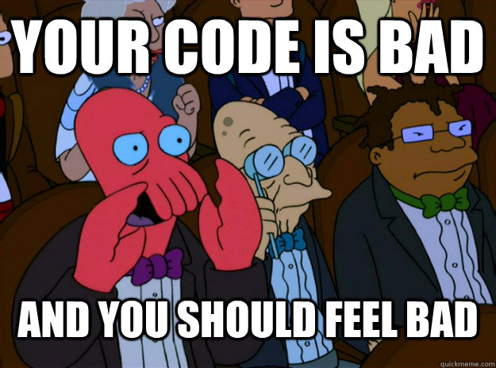

I recently started work for a [new (and very exciting) company](http://www.futuredigital.co.uk/). Like many of my previous roles, this one entails a good mix of [*Brownfield*](http://en.wikipedia.org/wiki/Brownfield_(software_development)) and [*Greenfield*](http://en.wikipedia.org/wiki/Greenfield_project) development. I've met and worked with some great developers who would outright refuse roles that held too much Brownfield work, preferring pastures green, as well as working with some great software devs that prefer the challenge of Brownfield.

_Image from [Virtual Geek](http://virtualgeek.typepad.com/virtual_geek/2015/08/vmworld-2015-cloud-native-apps-a-complex-interesting-but-fascinating-story.html)_
{: style="font-size: 12px; text-align: center;"}

I can't attest to *enjoying* brownfield work personally, but it's unavoidable. Its my belief that the software development industry as a whole is pretty damn terrible; our disciplines and professionalism not focused sufficiently nor at an early enough point in the personal development of junior roles, leading to an exponential influx of technical debt and subsequent likelihood of brownfield. Be that true or not, I've only ever had **one** role that was purely greenfield (out of *many*).

I wouldn't say I'm *old* exactly, but I've certainly been around long enough to have worked on software developed pre the [*dot-com bubble*](https://en.wikipedia.org/wiki/Dot-com_bubble). I've worked with all the key *.Net* web technologies, and several that existed prior to the birth of *.Net*. In that time, I've collected and refined a number of lessons that it's about time I put to paper and potentially pass on (plus invite comment on further insights and improvements on these techniques).

## Estate

The first task towards orchestrating the migration or uplifting of heritage software is establishing the *estate*. Oftentimes you'll be working with developers long since devoid of the original authors and left with little more than speculation and grey area, but your number one job is to understand the functionality of your entire software suite. You don't need to know how it works, and as amusing or aggrevating as the *why it works that way* might be, that isn't necessarily of importance either.

### Tact

Presume that the bizarre and downright crazy code and practices you come across were driven by one reason or another that you simply can't comprehend through fault of your own. Accept those decisions were made and there's little that whining about it will do to change a thing.

I'm a big fan of of this quote

> *"Always code as if the person who ends up maintaining your code is a violent psychopath who knows where you live." - [John Wood (probably?)](https://stackoverflow.com/questions/876089/who-wrote-this-programing-saying-always-code-as-if-the-guy-who-ends-up-maintai)*

...but in all likelihood, the developers who wrote the software didn't hear that advice. Jeff didn't even post it until 2008, there's a fair chance the quote wasn't around when the software was developed!

I say this, because there are only two real ways to establish your estate. The first and most preferable is through the experience of others. Ask questions starting at high level design, digging down as necessary, but making an effort not to point fingers. If the people answering your questions are not aware how bad their code is, teach them by example through excited demonstrations of good software at a later date, **not** by shaming them.

> *Caveat: I'm terrible at this. Bad code **really** gripes me and it's not uncommon for my mouth to move before my brain catches up. In closed company this can be a great stress relief, and I've no problem with anonymous/redacted submissions to [The Daily WTF](https://thedailywtf.com), but trust me when I say that rubbing people up the wrong way, no matter how inadequate you may think their skillset, will **not** help you.*

_Image from [Quick Meme](http://www.quickmeme.com/)_
{: style="font-size: 12px; text-align: center;"}

### Mining

Alongside passes of gaining information from peers that may have been around longer than you, where available, you'll also need to dig through code. In an ideal world, you'll have an up to date and comprehensive test suite (**never** happened for me...) but more than likely you'll jump to a test project to find empty, redundant, commented out superfluous blocks of code.

In that case, establish the public endpoints. What is the customer facing surface area of the product? What are the common interactions? How does the code accomplish these tasks? What services, API calls, database logic and so forth is required to achieve the most basic and most common aspects?

Drill down from this surface area. You don't need to memorise, graph and document every call, and you'll probably never find out why *it* was done in such an awkward way. You just need to get a feel for how the thing hangs together.

## Goal

You might think that this section should have come earlier. But actually, regardless of goal, the estabilishing of one's estate is something I'd begin on day 1 of any role, regardless of goal. If you're moving into a greenfield role, great, it won't take very long to work out what's already there!

If you're lucky, you're working for a CTO or manager that values intelligent, self-managing autonomous teams. I've seen a lot of this of late and been fortunate in that my past several roles were operated on such a level.

That being the case, you will be *given* a goal (typically one or more objectives alongside appropriate deadlines) and hopefully not a lot else. I can't offer specific advice on assessment of your goal, they'll obviously be case by case. However, there are a couple of approaches you can take regarding high level planning.

### Top-Down

> *Note: I've noticed that I don't always agree with which way round "top-down" and "bottom-up" describes these mechanisms. I'll describe them as I visualise them in my head, but be aware I or others may use the inverse!*

Knowing what the product does, having established the estate, albeit not including all the nuances and finer detail, how would you write the product from scratch. With your team, draft and design, at a high level, what that system would look like. What tech stacks would you be looking at, what architecture, what deployment infrastructure, security, resilience, and so forth, would be built in.

This system, subject to change as requirements are deduced and refined, is now your goal. The question becomes, how do you *iteratively* arrive at your goal.

If your plan is to *File -> New Solution* and one day flick a switch, chances are you're doomed to failure. Honestly, I've seen it time and again. I've heard in passing from proud CTO's where such an endeavour has paid off, but it is a massive and *unnecessary* gamble. By and large, all you'll achieve is the creation of an incomplete product fork that is shelved when the cash runs dry, or is forced into the wilderness despite reduced and unfinished functionality, causing your customers no end of pain.

This *Greenfield the Brownfield* technique is surprisingly common. I've worked at a company who attempted to greenfield their product FOUR times. Each time it failed. The time and resource waste is simple incomprehensible. By the time I arrived at that company, every user of the system had been bought a second monitor so that they could keep old and new systems open and enter data into both systems simultaneously...

_Image from [Uncyclopedia Wiki](http://uncyclopedia.wikia.com/wiki/File:Funny_wtf_cat.jpg)_
{: style="font-size: 12px; text-align: center;"}

Again, how you get from A -> B is going to be case by case, but try to define phases that get you from the current code base to your end goal. There are some migration techniques later in the article that may help you achieve this.

### Bottom-Up

Given the current estate, what needs addressing first and foremost? Using some of the techniques described below, you should be able to find a way to have new and old systems coincide, allowing you to iteratively replace endpoints and/or pipelines.

Keep improving upon the worst areas, driven by customer demand typically though evaluation of technical debt where time permits. With this approach, I find you end up in a *hybrid* state for longer than is the case with *top-down*, but if you're focus is on addressing problem areas, presumably any lingering legacy code isn't causing you a great deal of harm.

In that respect, this approach, while not my preference, can be more palatable to stakeholders. Better yet, you don't need any *permission* or *sign-off*. If words like *"migration"* and *"re-write"* are a big no-no, consider it a matter of professionalism to take this bottom-up approach. Be bold and brave, introduce new techniques and best practices as you see fit - don't just go with *the norm*!

You should *never* approach a product owner and say

> *"If I do it **properly** it'll take this long, but I can hack it in much quicker if needs be*

I have had the good fortune to work with good product owners that will prefer the first option, but the latter is all too often the preference. The thing is, you're a professional, right? The latter needn't be an option! You have the choice, you are the one writing the code, you are the one estimating the change. You can say "no".

> *Caveat: There needs to be a pragmatic vs. dogmatic balance here. If you leave you product owner or stakeholders in a bind, you may be doing more harm than good to your company, no matter your intentions. Typically there's a middle ground option that both sides can compromise and agree to.*

## Migration

So you've established your estate, determined a preferred migration methodology, and put together some flexible high level phases that will get you to your goal. Now the really tough part begins, how to get there?

I'm going to list a few titbits I've picked up over the years, including code samples where applicable, that may help you achieve your ends. These particular code samples will be focused on the web stack, but I've had ample experience with WinForms, WPF, UWP (desktop based) technologies so if you'd like some advice there, ping me a comment and I'll draft up some notes.

If you have something specific in mind, feel free to jump to the section below that best describes where you are right now.

### ASP Classic

I'm sorry. So sorry. I'm not sure to which gods you believe in nor how you offended them, but I certainly don't envy you.

Facts are you're running outside of .Net, and almost certainly on an outdated version of IIS, on bare metal. Your options here really are very limited and dependent on circumstances. I haven't had to do this for a long while, but my advice would be:

* See if there is an IIS version (preferably latest) that can side load both your ASP Classic site and a .Net site. If the answer is yes, jump to the [Proxy](#proxy) section below.
* Is the site addressed by DNS instead of by IP directly? If so, you can still try the [Proxy](#proxy) methodology.
* If the site is addressed directly, and/or the site relies on some crazy old undocumented and unsupported `dll`, chances are you're going to have to suck it up and some components en-masse. However, still check out the [Testing](#testing) sections below on some advice on how to do so more safely.

### Web Forms

As a technology, I consider Web Forms worse than ASP Classic. The bastardisation of HTTP to better suit desktop minded developers, whilst a viable developer migration strategy for Microsoft, was in all other respects a mistake. ASP Classic was at least not all that different from *modern* scripting languages such as PHP, which whilst I might frown upon, have their uses. If all you've ever done is Web/Win Forms, this is going to be *real* tough. Everything you thought you knew about the web was a thinly veiled lie; you need to throw damn near all that knowledge away and start over.

However, once you know enough about ASP.Net MVC, I recommend checking out existing articles such as [Rachel Appel's guide](http://rachelappel.com/integrating-aspnet-web-forms-and-aspnetmvc/) to sideloading Web Forms and MVC. This will allow you to introduce MVC mechanisms into your web application. Once the infrastructure is in place, all new work should be completed using the MVC architecture, and whenever a significant amount of work is required within an existing Web Form, consider moving the code to MVC instead (bearing in mind aforementioned pragmatic/dogmatic caveat).

If you're wondering if there's any real benefit to MVC over Web Forms, the answer is categorically **YES**. Do it, do it as soon as possible, and never look back. The only reason Web Forms continues to be supported by Microsoft is there are some money bag enterprise customers out there ~ruining it for the rest of us~ clinging on to their old systems and MS doesn't have the grit to tell them where to stick it. It's a truly awful tech, and taht's coming from someone who was in that position once. I was *brought up* on Win & Web Forms. I get it. It's tough. But you **have** to move on.

Once you have the MVC side loading in place, checking out the [Testing](#testing) section below for tips on how to more safely migrate heritage code.

### MVC

Want to get into all this *.Net Core* malark but don't know where to start? Or finally finished that Web Form to MVC migration and you're patting yourself on the back? Uh uh. There's further to go yet.

Check out the section below on [Full-Fat .Net Core](#full-fat-net-core).