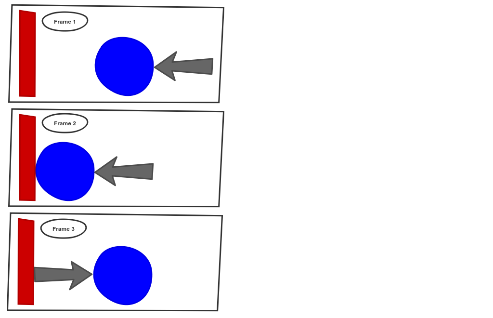
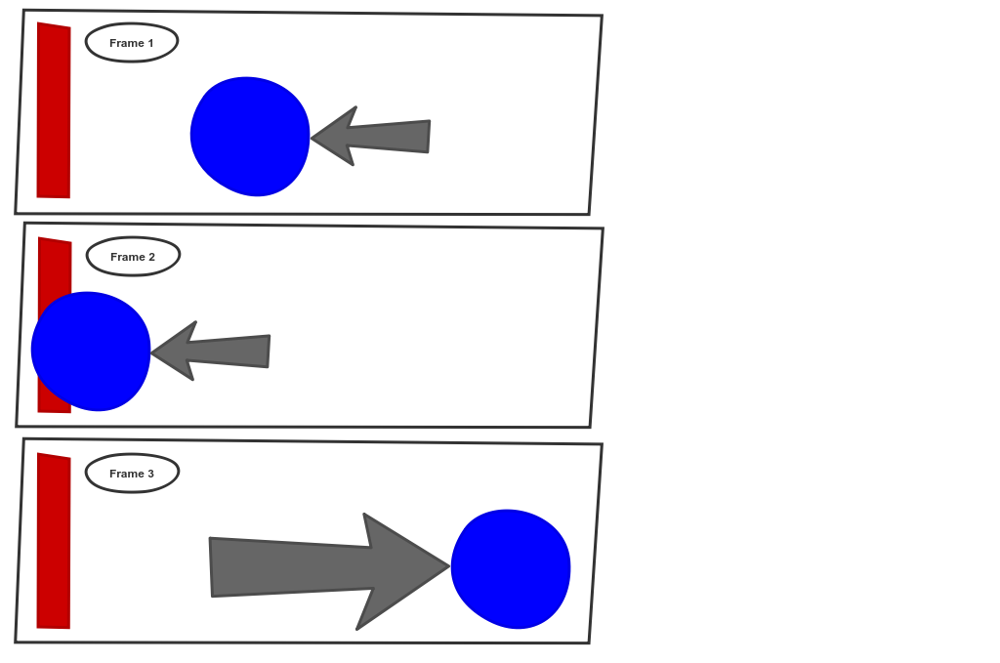
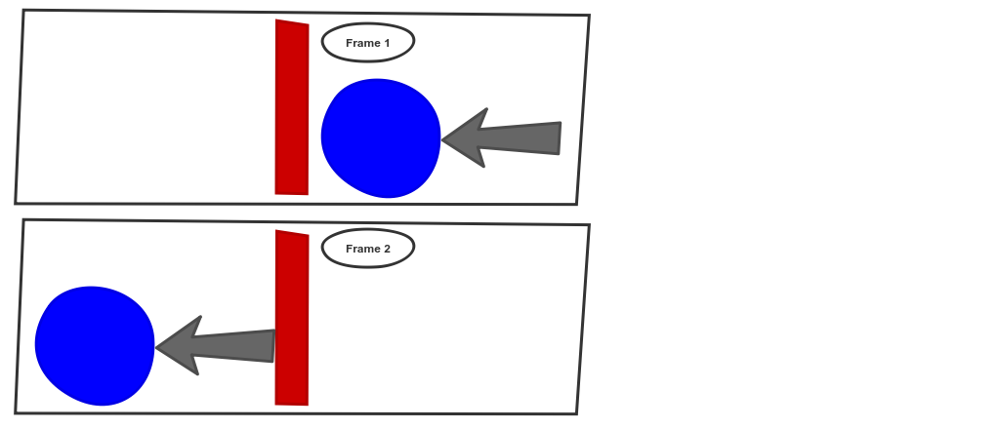

Quite some time ago, following a short and shallow [review](http://blog.devbot.net/industry/) of the game development industry, I started writing a game; [Clean Space](http://blog.devbot.net/clean-space-introduction/). Work on the game is ongoing and I have learned an incredible amount so far. Whilst I'll happily talk the ears off of anyone in proximity that shows but a hint of interest, I've done very poorly at writing down some of the lessons I've learned throughout the course of Clean Space's development. So, in this article, I want to talk about *"The Game Loop"*, how it fits into major Game Engines, and why I very quickly came to the conclusion that it is **wrong**.


## Concept

Let's start with describing what exactly the Game Loop is. Anyone that has written a game will have come across this very well known and widely adopted pattern of game development. I don't want to spend particularly long on this because authors like [Bob Nystrom](https://twitter.com/munificentbob) have some really [great content](http://gameprogrammingpatterns.com/game-loop.html) on game loops, why they exist, and how they solve certain problems.

The premise however is something along the lines of the following:


Unlike event driven frameworks where code executes in response to an event being triggered, games cycle through frame by frame, each time looking for what user inputs have been registered, then processing the game state, before rendering (drawing onto the screen) said state.

There are of course variations to this which accommodate different usages and alleviate certain problems, but that's the crux of it.

Within the game loop, access is provided in one way or another to a *delta time* which indicates for how long the game has been running. With this information, you should be able to determine the state of each entity. For example, knowing an in-game car is travelling at a given speed in a given direction, and having been provided how long the game has been running, you can calculate where exactly the car should be and draw/render it at that location.

## Game Engines

Game Engines, paraphrased from [wiki](https://en.wikipedia.org/wiki/Game_engine) are:

> Software frameworks designed for the creation of games. The core functionality provided by game engines include rendering engines, physics engines, collision detection, sound... *and a whole lot more*.

Long story short, they're complicated beasts working hard to make game development as *accessible* as possible. The maths behind a lot of game mechanics, especially rendering, is mind boggling. A game engine can abstract that away and provide far simpler interfaces.

I work primarily in C#, so the biggest engines of relevance (and therefore the only 2 I'll talk about throughout the rest of this article), are [Unity](https://unity3d.com/), and [MonoGame](http://www.monogame.net/).

Whilst the API surfaces differ wildly between these two frameworks, they both operate Game Loops. Unity hides the loop almost completely, but evidence of it is still apparent in the [MonoBehaviour](https://docs.unity3d.com/ScriptReference/MonoBehaviour.html) class *"from which every Unity script derives"*. This class has a broad range of methods and event mechanisms you can latch onto within the execution of the loop, but the most obvious (and probably most common) of these is the [`Update` Method](https://docs.unity3d.com/ScriptReference/MonoBehaviour.Update.html).

The signature for the method is completely vanilla:

```csharp
void Update();
```

And access to the aforementioned *delta time* is achieved through the static `Time.deltaTime` (don't get me started on the casing...).

MonoGame by contrast has a much more obvious loop sat in the class that derives from [Game](http://www.monogame.net/documentation/?page=T_Microsoft_Xna_Framework_Game):

```csharp
void Update(GameTime gameTime);
```

Instead of accessing a *delta* from some `static` member, the [`GameTime`](http://www.monogame.net/documentation/?page=T_Microsoft_Xna_Framework_GameTime) (correctly cased...) is passed to the update method.

I'll state now that I vastly prefer the MonoGame API over Unity, not just because Unity refers to **code** as *scripts*, or because Unity hasn't come across a C# convention for properly naming and casing members, nor even because most of Unity's examples and documentation uses Java formatting conventions. It's because I've found MonoGame a lot more extensible, and given the problems I highlight below, the ability to extend (and *correct*) certain aspects is very important to me.

## Dependency Injection

I'm not going to waste time explaining the benefits of dependency injection (DI) here. I consider it a must have, and I consider [service location](http://blog.ploeh.dk/2010/02/03/ServiceLocatorisanAnti-Pattern/) completely unacceptable. However, neither of these very mature game engines are at all supportive of DI.

Unity in particular is such a black box that I didn't really get anywhere with it. Instead, if you want DI in Unity, I suggest you check out [Zenject](https://github.com/modesttree/Zenject). Given my lack of affection for Unity, I'm not really interested in spending more time looking at the internal structure in order to achieve DI for myself.

MonoGame is a different story. The engine instantiates (or *bootstraps*) itself slightly differently depending on the platform you're developing against. If we use *Universal Windows Platform* (UWP) as a common denominator, available as a platform in both engines, I'll explain how MonoGame's dependency structure, whilst at least accessible, by default would force an awkwardly positioned [composition root](http://blog.ploeh.dk/2011/07/28/CompositionRoot/).

MonoGame supports two versions of UWP. In the case of 'UWP (Xaml)', application initialisation is as follows *(note, many lines removed for sake of brevity)*:

```csharp
public class App : Application // App.xaml.cs
{
  protected override void OnLaunched(LaunchActivatedEventArgs e)
  {
    rootFrame.Navigate(typeof(GamePage), e.Arguments);
  }
}

public class GamePage : Page // GamePage.xaml.cs
{
  public GamePage()
  {
    _game = MonoGame.Framework.XamlGame<Game1>
              .Create(launchArguments, Window.Current.CoreWindow, swapChainPanel);
  }
}
```

`Game1` on line 13 above is the start of your game code. The 'UWP (Core)' variant is similar (though simpler):

```csharp
public static class Program
{
  static void Main()
  {
    var factory = new MonoGame.Framework.GameFrameworkViewSource<Game1>();
    Windows.ApplicationModel.Core.CoreApplication.Run(factory);
  }
}
```

In both of these cases, I'd at the very least like to DI my `Game1` class. In fact, I'd even go further than that and in addition to having the Game itself constructor injected to help me with game intialisation, I'd also want the means to convention inject the `Update` method with a *frame-scoped* container. That is to say, I'd like to be able to do the following:

```csharp
public class Game1
{
  public Task Update(Logger logger, MyService foo, MyOtherThing bar)
  {
    // have the services be scoped to the frame
  }
}
```

So what's preventing this? Well if we take a look at the constructor of `Game1` (auto-generated from the MonoGame templates) we'll see the following:

```csharp
public Game1()
{
  graphics = new GraphicsDeviceManager(this);
}
```

The `graphics` field we assign the new [`GraphicsDeviceManager`](http://www.monogame.net/documentation/?page=T_Microsoft_Xna_Framework_GraphicsDeviceManager) to isn't actually used in the rest of the template, so you might think you can just throw that line of code away. You'd be wrong:

> System.NullReferenceException: 'You must create the GraphicsDeviceManager in the Game constructor!'

*(Actually, in UWP Core you won't get any exception at time of writing, the program will just terminate)*.

To further hamper matters, the `GraphicsDeviceManager` constructor contains the following lines:

```csharp
public GraphicsDeviceManager(Game game)
{
  _game = game;
  _game.graphicsDeviceManager = this;
}
```

...and that `Game.graphicsDeviceManager` property is `internal`. Anyone that has done a good amount of dependency injection will tell you that two classes depending upon one another is unattainable, akin the age old adage, *'chicken vs. egg'*.

We'll consider this problem number one.

## I/O

It basically isn't possible to write a game that completely avoids I/O. At the very least, the game will need to be loaded from disk at some stage. However, more importantly, whilst not unavoidable, it would be extremely problematic to avoid I/O within the game loop (if you were to follow the conventions prescribed by most game engines). Any time you read or write to disk or network, you involve I/O.

Traditionally, I/O or read/write operations were what we called *blocking* operations. That is, a computational *thread* would have to sit and wait for the operation to complete (be blocked) until the operation completed and execution could continue. Fortunately, this problem was solved in Windows at least many years ago with the introduction of [*I/O Completion Ports*](https://msdn.microsoft.com/en-us/library/windows/desktop/aa365198(v=vs.85).aspx) (or *IOCP* for short).

For more than 5 years now, .Net has had [`await/async` functionality](https://docs.microsoft.com/en-us/dotnet/csharp/async) that makes utilising IOCP all but child's play. And yet, looking back to the game loop signatures I described above, IOCP is at best a second class citizen of these game engines; I am yet to come across an API in either of the game frameworks that utilises `async/await`.

The reason for this, I would speculate, is the complexity of [`SynchronizationContexts`](https://msdn.microsoft.com/en-us/library/system.threading.synchronizationcontext(v=vs.110).aspx). UI's are very particular, in an attempt to protect themselves, about which thread can access and manipulate them. If a game engine were to introduce such mechanisms it would be easier for the UI thread to get lost during execution of a loop iteration, and I expect the respective forums and issue trackers would be inundated with users having sync context issues.

However, if you're comfortable with these threading mechanics, it becomes a nuisance that the APIs are all but prohibitive of async usage. We'll call this problem number two.

## Physics

There's many aspects to physics, so I'll just pick on a couple of obvious collision based examples that you may well have come across whilst playing games. Imagine that all your game logic is tied into your game loop which iterates *per frame*. We'll start with the example of a ball bouncing off of a wall:



In this example we see in the first frame that the blue ball is approaching a red wall. In frame two, the ball hits the wall, and in frame three the ball has bounced off of the wall. Easy.

But what if the ball is moving too fast for your frame rate and the exact point at which the ball hits the wall is missed?



As before, we start with a ball approaching the wall. But, in the second frame the ball is calculated to be intersecting the wall! So, what should the physics engine do about this? It knows that two solid objects can't intersect, so in frame 3, this arbitrary examples applies sufficient force to the ball that it flies off into the sunset. You see examples of this in modern games very often, physics engines over-compensating for overlapped bounding boxes.

There is also a third simple example to consider:



In this example, the ball was moving so fast (or the frame rate so low) that in frame 1 it appears to the right of the wall, and in frame 2 it's on the left. There was no frame where the ball and wall were in contact, so no collision was acted upon. The ball simply passes through. This example is less common, though probably more as a result of superior hardware allowing high frame rates as opposed to polished physics engines!

We'll call this problem three.

## Performance

Have you ever played a game that completely freezes up when you click *"Load Game"*, or more obnoxiously as the message *"Autosaving..."* appears? Have you ever clicked a button or passed a way point, and the world just stops?

This is a symptom of performing operations on the UI thread that do not belong there. Actions like those mentioned earlier in the [I/O section](#io).

However, if you attempt to alleviate this by performing all your game logic processing on one thread and leaving the UI thread to do nothing more than render that state, you have to *synchronise* those threads. That's a non-trivial task; you never want more than one thread accessing the same thing, at the same time.

For example, imagine you have a ball that you want to move diagonally. The ball starts in `X = 0; Y = 0` and you want to move it to `X = 1; Y = 1`.

To start with, the ball is at zero and the UI thread renders it so. Your game state thread then begins moving your ball, but only gets as far as setting `X = 1` before the UI thread jumps in and reads the balls state, which at this point in time is `X = 1, Y = 0`. Your ball suddenly hops up instead of diagonally on the screen...

Thread synchronisation has actually been around for longer than there has been multi-core CPUs. Even single core processors can run multiple threads, with the OS determining (scheduling) which thread can run at which points. That means, it's been around for a long time. And in that time we've developed a large number of ways that both help synchronise threads, and better isolate threads.

Whilst there's no silver bullet, it's my belief that a game engine should provide much better mechanics for performing asynchronous operations, actively encouraging splitting apart logic from the game loop. Unity goes so far as to provide a [coroutine](https://docs.unity3d.com/Manual/Coroutines.html) mechanism which is a poor man's version of the `async/await` functionality discussed earlier, with the added downside of not being intrinsically compatible with the .Net API surface.

We'll call this problem number four.

## First World Problems

These are the problems I encountered on day 1. Unfortunately, it took much more than that first day to address each of these issues.


However, given this article has already hit over 2000 words, I'll break out write-ups on how I went about solving these problems into a [mini-series](http://blog.devbot.net/tag/game-loop/). Subscribe or check back for solutions on each of the problems listed above!