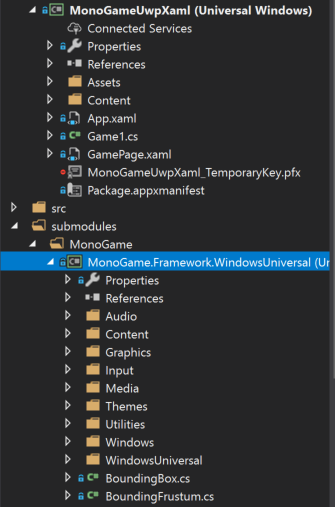
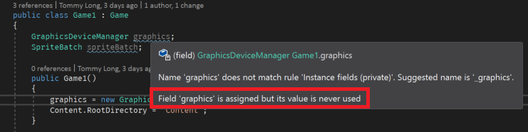

In the [previous article](http://blog.devbot.net/game-loop/) of this [mini-series](http://blog.devbot.net/tag/game-loop/) I talked about the [problems](http://blog.devbot.net/game-loop/#dependency-injection) inherent in [MonoGame](http://www.monogame.net/) (and other Game Engines) that effectively prevent Dependency Injection (DI). During the development of [Clean Space](http://blog.devbot.net/clean-space-introduction) I made several attempts to resolve this particular issue, and in this article I want to describe the first (pretty crude) mechanism I put together.


I'll also explore (and *prove*) the performance considerations of making changes like this to MonoGame, whilst contrasting this *dependency injection* pattern to the many [*service locator*](http://blog.ploeh.dk/2010/02/03/ServiceLocatorisanAnti-Pattern/) anti-patterns I've seen used as workarounds.

## First World Problems

So the issue with MonoGame, and I'll keep reiterating that it's not limited to *just* MonoGame, is that there are no abstractions, and many classes have inter-dependencies. That is to say that class *A* depends on class *B*, and class *B* depends on *A*. This problem very quickly rears it's ugly head if you follow the application bootstrapping code, as demonstrated in the previous post.

Throughout this article I'll be working exclusively with the [`dev` branch](https://github.com/MonoGame/MonoGame/tree/develop) of MonoGame, but the [*Universal Windows Platform*](https://docs.microsoft.com/en-us/windows/uwp/get-started/universal-application-platform-guide) (or 'UWP' for short) XAML project is much the same as in the MonoGame 3.6 Stable version. As such, let's recap and explore the application startup of a UWP XAML project.

> *Note: ['XAML'](https://msdn.microsoft.com/en-us/library/cc295302.aspx) stands for 'e**X**tensible **A**pplication **M**arkup **L**anguage' and is an XML-based language designed by Microsoft to describe the visual components of your Application.*

## Startup (XAML)

Each platform MonoGame supports has a slightly different startup mechanism, primarily dictated by the Windows and .NET Framework calls that need to be made in order to get an application up and running. In the case of a UWP XAML application, the first bit of code to run (that we can see) is that contained in `App.xaml.cs`.

Whilst this class contains around 130 lines of code by default (from the project template) most of that isn't too important with regards to Dependency Injection. The only line that really matters to us right now is:

```csharp
rootFrame.Navigate(typeof(GamePage), e.Arguments);
```

During startup, because nothing has been navigated to or displayed yet, the application will transition to `GamePage`. At this point, the code in `GamePage.xaml.cs` will be executed:

```csharp
public sealed partial class GamePage : Page
{
  readonly Game1 _game;

  public GamePage()
  {
    this.InitializeComponent();

    // Create the game.
    var launchArguments = string.Empty;
    _game = MonoGame.Framework.XamlGame<Game1>
      .Create(launchArguments, Window.Current.CoreWindow, swapChainPanel);
  }
}
```

This is the first point at which MonoGame gets involved. Here we can see that it is trying to load the `Game1` class into a `SwapChainPanel` (which the project template has declared for you in `GamePage.xaml`).

Before we take a look at the `Game1` class, let's have a look at the code that executes within the [`XamlGame<Game1>.Create` method](https://github.com/MonoGame/MonoGame/blob/develop/MonoGame.Framework/WindowsUniversal/XamlGame.cs#L28-L56):

```csharp
static public T Create(string launchParameters, CoreWindow window, SwapChainPanel swapChainPanel)
{
  //argument validation...

  // Save any launch parameters to be parsed by the platform.
  UAPGamePlatform.LaunchParameters = launchParameters;

  // Setup the window class.
  UAPGameWindow.Instance.Initialize(window, swapChainPanel, UAPGamePlatform.TouchQueue);

  // Construct the game.
  var game = new T();

  // Set the swap chain panel on the graphics mananger.
  if (game.graphicsDeviceManager == null)
      throw new NullReferenceException("You must create the GraphicsDeviceManager in the Game constructor!");
  game.graphicsDeviceManager.SwapChainPanel = swapChainPanel;

  // Start running the game.
  game.Run(GameRunBehavior.Asynchronous);

  // Return the created game object.
  return game;
}
```

There's a lot more happening here than everything else so far. We can ignore the argument exceptions (excluded for brevity above) and jump straight to `UAPGamePlatform` and `UAPGamePlatform`. 'UAP' is short for [*Universal Apps*](https://msdn.microsoft.com/en-gb/magazine/dn973012.aspx) which is what we called 'UWP' a few years ago when the concept was first introduced. The classes in question actually belong to the `XNA` namespace (not MonoGame) which is a game framework Microsoft stopped developing several years ago before the MonoGame community picked up the reins.

> *Note: 'XNA' is not an acronym. [Greg Duncan explained](https://channel9.msdn.com/coding4fun/blog/ANXFramework-ANXs-not-XNA-but-kind-of) that if anything, 'XNA' stands for '**X**NA's **n**ot **a**cronymed'...*
>
>
>
> ...but at least it's one less acronym from Microsoft to try and remember.

The `Initialize` method on the `UAPGameWindow` class is also very involving, not to mention `internal` so is otherwise not visible to us.

Once the XNA components are configured, MonoGame goes on to instantiate our `Game1` class (passed as a generic `T`), then complain (by throwing an exception) if you don't set the `graphicsDeviceManager` property (which is also `internal`...) before calling the public `Run` method on the inherited `Game` class.

The reason I keep highlighting these `internal` members is it means, unless we're writing code in the same assembly as MonoGame, or MonoGame for some reason exposes it's internal members to our code using an `InternalsVisibleTo` attribute, we can only *access* those classes via reflection, and doing so would not be type safe. This is a *huge* problem with regards to extensibility because it makes it either impossible or very *unsafe* to extend and change behaviours.


## Submodules

There are a number of approaches to tackling the above problems, but the one I've opted for here is to use a [git submodule](https://git-scm.com/docs/git-submodule) to pull in the MonoGame source code, have my project reference the submodule, and then hack away at it until things are working.

> *Note: I don't want to spend time explaining submodules and how to work with them, so if it's a concept you're not familiar or comfortable with, I recommend checking out a [tutorial](https://git-scm.com/book/en/v2/Git-Tools-Submodules) and then heading back here afterwards.*

Before I get started on this approach though, I want to say that this is a *bad* idea. By submoduling the MonoGame repository I'm introducing a fork that I then become responsible for maintaining (like applying the latest commits from the parent). On a large active repository like MonoGame, it really isn't very workable. However, it is a useful mechanism for *exploring* problems with frameworks you depend on.

Per the [MonoGame README](https://github.com/MonoGame/MonoGame#source-code), once you've initialised the MonoGame submodule and in turn, MonoGame's submodules, you can run `Protobuild.exe` to generate the necessary `csproj`'s. Protobuild will generate a `MonoGame.Framework.WindowsUniversal.csproj` in the `MonoGame.Framework` directory, which we can add to out solution as an existing project:



With the MonoGame source code now available, drop the *assembly* reference to `MonoGame.Framework` in your own application, and add a *project* reference to `MonoGame.Framework.WindowsUniversal` in it's place. Your application should still build and be able to execute (though in my case I do get a build warning about differing versions of `System.Runtime.WindowsRuntime` which I'll ignore).

Whilst that seems like a lot of work to have achieved nothing, what it actually means is that we can now edit the MonoGame code and see that reflected immediately in our own application. Given the power and authority to change MonoGame code, the next sections outline the changes I would make in order to better support dependency injection.

## Initialisation

If you remember from my [previous post](http://blog.devbot.net/game-loop/#dependency-injection) there's actually two aspects of dependency injection I would like to improve. The first is constructor injection for my `Game` class during initialisation (when the game first loads, or perhaps resumes from sleeping in some cases). The second case was *scoped convention injection* during each iteration of the loop (each time the `Update` method is called).

The two mechanisms are very different so we'll tackle each in turn. Whenever you make a change to an application, there are several things you need to take into account, one of which is *performance*. I could spend time benchmarking application initialisation times before and after my changes, but the fact is, if your game reads any file (textures, sprites, audio clips, etc) or pops out to the internet, which is very likely when you're loading a game, the minuscule amount of time it takes to run dependency injection by comparison makes it a complete non-entity. As such, I'm not even going to consider performance for game initialisation. However, when we look at interfering with the update loop, which runs very often and needs to execute very quickly, we'll definitely spend some time benchmarking.

When following the startup code, we saw that the execution flow is roughly:

`App.xaml.cs` → `GamePage.xaml.cs` → `Game1.cs` → `GraphicsDeviceManager.cs`

The `GraphicsDeviceManager` however requires a reference to `Game1`. Normally, this would be a good thing. We call it *[dependency inversion](http://blog.devbot.net/composition/#dependency-inversion-principle-dip)*, however the two classes are very *[strongly-coupled](https://stackoverflow.com/a/3085419/707618)*.

The question therefore becomes, why does `Game1` need `GraphicsDeviceManager` and vice-versa. What we're aiming for is for one class to depend on the other, ideally through abstractions, but not both classes depending on each other. Therefore, I started this exercise by determining for what reason each class depends on the other, and therefore which I'd find the easiest to cut loose.

### Decoupling Game from GraphicsDeviceManager

The custom `Game1` class created by the project template doesn't appear to depend on `GraphicsDeviceManager` at all.



But, if you follow code execution, you'll find that the constructor of `GraphicsDeviceManager` also assigns itself to an internal property of the `Game` class, which your custom `Game1` class inherits from:

```csharp
internal GraphicsDeviceManager graphicsDeviceManager
{
  get
  {
    if (_graphicsDeviceManager == null)
    {
      _graphicsDeviceManager = (IGraphicsDeviceManager)
        Services.GetService(typeof(IGraphicsDeviceManager));
    }
    return (GraphicsDeviceManager)_graphicsDeviceManager;
  }
  set
  {
    if (_graphicsDeviceManager != null)
      throw new InvalidOperationException("GraphicsDeviceManager already registered for this Game object");
    _graphicsDeviceManager = value;
  }
}
```

Interestingly, whilst you can't set this field to `null` without causing an exception, when it is null, the property getter will attempt to populate itself using `Services`, which is a public property returning a `GameServiceContainer`. Going back to the constructor of `GraphicsDeviceManager`, we see that it adds itself to this `GameServiceContainer` right at the end of its constructor:

```csharp
_game.Services.AddService(typeof(IGraphicsDeviceManager), this);
_game.Services.AddService(typeof(IGraphicsDeviceService), this);
```

The `GameServiceContainer` actually implements `System.IServiceProvider` which is well known for being the interface for Dependency Injection Containers. So, there is DI here already? No.

If you check out the [code for `GameServiceContainer`](https://github.com/MonoGame/MonoGame/blob/develop/MonoGame.Framework/GameServiceContainer.cs) you'll see that all it really does is wrap around a `Dictionary<Type, object>`. Any object added to the dictionary can be retrieved at a later date. It is a *Service Collection*, but it doesn't actually perform any dependency injection. The idea behind dependency injection is that the services registered in your composition root can be resolved, and the dependencies of the service you're resolving can also be injected in turn (recursively working its way down all the dependencies until they've all been satisfied), building up a veritable tree of classes in order to serve the top level class you've requested.

So, we know that the `Game` class has a property that stores the `GraphicsDeviceManager`, but if the `GraphicsDeviceManager` property is null when it's needed, the `Game` class will go and fetch it from the *service collection*. To be safe, I followed the *backing field* for the property to make sure it isn't used directly elsewhere in the class, and to my dismay found that it is in fact used outside the property. Twice.

The first time is within the `Dispose` method:

```csharp
if (_graphicsDeviceManager != null)
{
  (_graphicsDeviceManager as GraphicsDeviceManager).Dispose();
  _graphicsDeviceManager = null;
}
```

This makes total sense. If the `Dispose` method used the property instead of the field when the field was `null`, then it would needlessly fetch the `GraphicsDeviceManager` from the service collection before disposing it and setting the field back to `null` again. If the `_graphicsDeviceManager` field is null, it'll behave just fine, though has the potential to not dispose the `GraphicsDeviceManager` sat in the service collection. That's something to bear in mind as we plough ahead, but if the Game hasn't used the `GraphicsDeviceManager` then there's probably not much to dispose anyway, so it's not too big a concern.

The second usage is in an internal method called `DoInitialize`, which is conditionally called by both `RunOneFrame` and `Run` public methods.

```csharp
if (GraphicsDevice == null && graphicsDeviceManager != null)
  _graphicsDeviceManager.CreateDevice();
```

We see here that the field `_graphicsDeviceManager` is only used after a conditional check against the `graphicsDeviceManager` property. That's good, it means if the field was null then the property will perform the service collection lookup and populate the field.

We're lucky it seems. At a glance, it would appear we can *slightly* decouple `Game` from `GraphicsDeviceManager`, so long as the `GraphicsDeviceManager` is available in the `GameContainerService`.


To be thorough, I also want to check what would be needed to do the opposite and reduce the reliance the `GraphicsDeviceManager` has on `Game`.

### Decoupling GraphicsDeviceManager from Game

Looking through the constructor on `GraphicsDeviceManager`, I can see that it stores the `Game` in a private field called `_game`, which has the following usages:


A couple of these you'll probably recognise from the section above as being part of the constructor and are not all that interesting to us here. There are several lines of note though. For starts, there are 4 usages of properties on `_game.Window` and 2 methods on `_game.Window` can be called throughout the class. Each of these are in private methods and their unclear to me (due to a lack of understanding on the MonoGame internals). Similarly, there is also a method on `_game.Platform` that the `GraphicsDeviceManager` can invoke.

Finally, the following is a snippet from the constructor, just prior to the `GraphicsDeviceManager` appending itself to the `GameServiceContainer`:

```csharp
if (_game.Services.GetService(typeof(IGraphicsDeviceManager)) != null)
  throw new ArgumentException("A graphics device manager is already registered.  The graphics device manager cannot be changed once it is set.");
```

This means that the only way to add the `GraphicsDeviceManager` to that container is through the constructor, and the constructor can only be invoked once. I immediately imagine that becoming a nuisance as we try to interfere with the current coupling, but we'll come back to it later.

All in all, the references to `Game` *from* `GraphicsDeviceManager` are much more difficult to understand and address. We could remove a lot of it's reliance on `Game` by providing the `_game.Window`, `_game.Platform`, and `_game.Services` classes on themselves (not attached to `Game`).