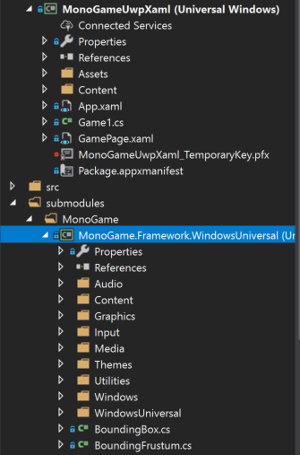

In the [previous article](http://blog.devbot.net/game-loop/) of this [mini-series](http://blog.devbot.net/tag/game-loop/) I talked about the [problems](http://blog.devbot.net/game-loop/#dependency-injection) inherent in [MonoGame](http://www.monogame.net/) (and other Game Engines) that effectively prevent Dependency Injection (DI). During the development of [Clean Space](http://blog.devbot.net/clean-space-introduction) I made several attempts to resolve this particular issue, and in this article I want to describe the first (pretty crude) mechanism I put together.


I'll also explore (and *prove*) the performance considerations of making changes like this to MonoGame, whilst contrasting this *dependency injection* pattern to the many [*service locator*](http://blog.ploeh.dk/2010/02/03/ServiceLocatorisanAnti-Pattern/) anti-patterns I've seen used as workarounds.

## First World Problems

So the issue with MonoGame, and I'll keep reiterating that it's not limited to *just* MonoGame (don't get me started on *Unity*), is that there are no abstractions, and many classes have inter-dependencies. That is to say that class *A* depends on class *B*, and class *B* depends on *A*. This problem very quickly rears it's ugly head if you follow the application bootstrapping code, as demonstrated in the previous post.

Throughout this article I'll be working exclusively with [v3.7.1](http://community.monogame.net/t/monogame-3-7-1-release/11173) of MonoGame, but the [*Universal Windows Platform*](https://docs.microsoft.com/en-us/windows/uwp/get-started/universal-application-platform-guide) (or 'UWP' for short) XAML project is much the same in the latest ['dev' branch](https://github.com/MonoGame/MonoGame/tree/develop) if you're inclined to be a bit more *cutting edge*. As such, let's recap and explore the application startup of a UWP XAML project.

> *Note: ['XAML'](https://msdn.microsoft.com/en-us/library/cc295302.aspx) stands for 'e**X**tensible **A**pplication **M**arkup **L**anguage' and is an XML-based language designed by Microsoft to describe the visual components of your Application.*

## Startup (XAML)

Each platform MonoGame supports has a slightly different startup mechanism, primarily dictated by the Windows and .NET Framework calls that need to be made in order to get an application up and running. In the case of a UWP XAML application, the first bit of code to run (that we can see) is that contained in `App.xaml.cs`.

Whilst this class contains around 130 lines of code by default (from the project template) most of that isn't too important with regards to Dependency Injection. The only line that really matters to us right now is:

```csharp
rootFrame.Navigate(typeof(GamePage), e.Arguments);
```

> *Note: Whilst it might seem I'm ripping into MonoGame for their lack of DI support in this article, it's worth mentioning that Microsoft are no better - they provide basically no DI support in UWP itself.*

During startup, because nothing has been navigated to or displayed yet, the application will transition to `GamePage`. At this point, the code in `GamePage.xaml.cs` will be executed:

```csharp
public sealed partial class GamePage : Page
{
  readonly Game1 _game;

  public GamePage()
  {
    this.InitializeComponent();

    // Create the game.
    var launchArguments = string.Empty;
    _game = MonoGame.Framework.XamlGame<Game1>
      .Create(launchArguments, Window.Current.CoreWindow, swapChainPanel);
  }
}
```

This is the first point at which MonoGame gets involved. Here we can see that it is trying to load the `Game1` class into a `SwapChainPanel` (which the project template has declared for you in `GamePage.xaml`).

Before we take a look at the `Game1` class, let's have a look at the code that executes within the [`XamlGame<Game1>.Create` method](https://github.com/MonoGame/MonoGame/blob/v3.7.1/MonoGame.Framework/WindowsUniversal/XamlGame.cs#L28-L31):

```csharp
static public T Create(string launchParameters, CoreWindow window, SwapChainPanel swapChainPanel)
{
    return Create(() => new T(), launchParameters, window, swapChainPanel);
}
```

This version of the `Create` method was actually introduced by [Francesco Bonizzi](https://www.fbonizzi.it/) in [October 2018](https://github.com/MonoGame/MonoGame/commit/ebcac5888d71069b67c6005a319490ce9dba91c7#diff-75d9e8e55eb0fd7e415e540939e8087b). This greatly simplifies (though doesn't solve) our DI considerations when compared to earlier versions. You see, whilst by default your Game class will be instantiated with `new T()`, we can see that there is an overloaded method of the `Create` method which accepts a `Func<T>`.

```csharp
static public T Create(Func<T> gameConstructor, string launchParameters, CoreWindow window, SwapChainPanel swapChainPanel)
{
  //argument validation...

  // Save any launch parameters to be parsed by the platform.
  UAPGamePlatform.LaunchParameters = launchParameters;

  // Setup the window class.
  UAPGameWindow.Instance.Initialize(window, swapChainPanel, UAPGamePlatform.TouchQueue);

  // Construct the game.
  var game = gameConstructor();

  // Set the swap chain panel on the graphics mananger.
  if (game.graphicsDeviceManager == null)
      throw new NullReferenceException("You must create the GraphicsDeviceManager in the Game constructor!");
  game.graphicsDeviceManager.SwapChainPanel = swapChainPanel;

  // Start running the game.
  game.Run(GameRunBehavior.Asynchronous);

  // Return the created game object.
  return game;
}
```

There's a lot more happening here than everything else we've seen so far. We can ignore the argument validation (excluded for brevity above) and jump straight to `UAPGamePlatform` and `UAPGamePlatform`. 'UAP' is short for [*Universal Apps*](https://msdn.microsoft.com/en-gb/magazine/dn973012.aspx) which is what we called 'UWP' a few years ago when the concept was first introduced. The classes in question actually belong to the `XNA` namespace (not MonoGame) which is a game framework Microsoft stopped developing several years ago before the MonoGame community picked up the reins.

> *Note: 'XNA' is not an acronym. [Greg Duncan explained](https://channel9.msdn.com/coding4fun/blog/ANXFramework-ANXs-not-XNA-but-kind-of) that if anything, 'XNA' stands for '**X**NA's **n**ot **a**cronymed'...*
>
>
>
> ...but at least it's one less acronym from Microsoft to try and remember.

The `Initialize` method on the `UAPGameWindow` class is also very involving, not to mention `internal` so is otherwise not visible to us.

Once the XNA components are configured, MonoGame goes on to instantiate our `Game1` class (passed as a generic `T`), then complain (by throwing an exception) if you don't set the `graphicsDeviceManager` property (which is also `internal`...) before calling the public `Run` method on the inherited `Game` class. Remember this bit because it'll become important later.

The reason I keep highlighting these `internal` members is it means, unless we're writing code in the same assembly as MonoGame, or MonoGame for some reason exposes it's internal members to our code using an `InternalsVisibleTo` attribute, we can only *access* those classes via reflection, and doing so would not be type safe. This is a *huge* problem with regards to extensibility because it makes it either impossible or very *unsafe* to extend and change behaviours.


## Interdependencies

Of the last block of code we looked at, the biggest problem by far is interactions with the `graphicsDeviceManager` property on the `Game` class. The property looks as follows:

```csharp
internal GraphicsDeviceManager graphicsDeviceManager
{
    get
    {
        if (_graphicsDeviceManager == null)
        {
            _graphicsDeviceManager = (IGraphicsDeviceManager)
                Services.GetService(typeof(IGraphicsDeviceManager));
        }
        return (GraphicsDeviceManager)_graphicsDeviceManager;
    }
    set
    {
        if (_graphicsDeviceManager != null)
            throw new InvalidOperationException("GraphicsDeviceManager already registered for this Game object");
        _graphicsDeviceManager = value;
    }
}
```

There seems to be some sort of *in-joke* about setting important fields as `internal` and not making them `virtual`, but I understand that this property is so intrinsic to other code in MonoGame that they wanted to protect it. We can see from the *getter* that if the private field `_graphicsDeviceManager` is `null` then it will populate the field using `Services`.

We haven't talked about this `Services` property yet but we'll circle back to it [later](#services). We can also see from the *setter* that if we make the mistake of attempting to set the `graphicsDeviceManager` property twice, we'll get an `InvalidOperationException`.

With that all in mind, let's take a look at this `GraphicDeviceManager` class, and in particular, it's constructor:

```csharp
public GraphicsDeviceManager(Game game)
{
    if (game == null)
        throw new ArgumentNullException("game", "Game cannot be null.");

    _game = game;

    // sets a load of graphics properties which I'll omit

    // Let the plaform optionally overload construction defaults.
    PlatformConstruct();

    if (_game.Services.GetService(typeof(IGraphicsDeviceManager)) != null)
        throw new ArgumentException("A graphics device manager is already registered.  The graphics device manager cannot be changed once it is set.");
    _game.graphicsDeviceManager = this;

    _game.Services.AddService(typeof(IGraphicsDeviceManager), this);
    _game.Services.AddService(typeof(IGraphicsDeviceService), this);
}
```

If you scroll up to the previous chapter, you may recall that `graphicsDeviceManager` was a property on the `Game` class (I told you that bit was important). During our exploration of the `Create` method we saw that if you don't set that property when constructing your `Game` then it will throw an exception. Here's a mini-recap:

```csharp
// Construct the game.
var game = gameConstructor();

// Set the swap chain panel on the graphics mananger.
if (game.graphicsDeviceManager == null)
    throw new NullReferenceException("You must create the GraphicsDeviceManager in the Game constructor!");
```

For those with experience with DI containers, you'll immediately see the issue here. In order to construct a `Game`, we must create `GraphicsDeviceManager`, but in order to construct a `GraphicsDeviceManager`, we must create a `Game`. Depending on the DI container you use, you'll either end up with a `StackOverflowException` as the container loops around playing *hot-potato* with these constructors, or the container will realise that neither class can be instantiated and throw an exception accordingly.

## Submodules

There are a number of approaches to tackling the above problems (and other problems we haven't discovered yet), but the first one I've opted for here is to use a [git submodule](https://git-scm.com/docs/git-submodule) to pull in the MonoGame source code, have my project reference the submodule, and then hack away at it until things are working.

> *Note: I don't want to spend time explaining submodules and how to work with them, so if it's a concept you're not familiar or comfortable with, I recommend checking out a [tutorial](https://git-scm.com/book/en/v2/Git-Tools-Submodules) and then heading back here afterwards.*

Before I get started on this approach though, I want to say that this is a *bad* idea. By submoduling the MonoGame repository I'm introducing a fork that I then become responsible for maintaining (like applying the latest commits from the parent). On a large active repository like MonoGame, it really isn't very workable. However, it is a useful mechanism for *exploring* problems with frameworks you depend on.

Per the [MonoGame README](https://github.com/MonoGame/MonoGame#source-code), once you've initialised the MonoGame submodule and in turn, MonoGame's submodules, you can run `Protobuild.exe` to generate the necessary `csproj`'s. Protobuild will generate a `MonoGame.Framework.WindowsUniversal.csproj` in the `MonoGame.Framework` directory, which we can add to our solution as an existing project:



> *Note: Once you've submoduled MonoGame, create yourself a branch at the v3.7.1 tag and checkout there, otherwise you'll default to the `develop` branch which has been set as the default.*

With the MonoGame source code now available, drop the *assembly* reference to `MonoGame.Framework` in your own application, and add a *project* reference to `MonoGame.Framework.WindowsUniversal` in it's place. Your application should still build and be able to execute (though in my case I do get a bunch of build warnings from the MonoGame project which I'll ignore).

Whilst that seems like a lot of work to have achieved nothing, what it actually means is that we can now edit the MonoGame code and see that reflected immediately in our own application. Given the power and authority to change MonoGame code, the next sections outline the changes I would make in order to better support dependency injection.

## Initialisation

You may remember from my [previous post](http://blog.devbot.net/game-loop/#dependency-injection) there's actually two aspects of dependency injection I would like to improve. The first is constructor injection for my `Game` class during initialisation (when the game first loads, or perhaps resumes from sleeping in some cases). The second case was *scoped convention injection* during each iteration of the loop (each time the `Update` method is called).

The two mechanisms are very different so we'll tackle each in turn. Whenever you make a change to an application, there are several things you need to take into account, one of which is *performance*. I could spend time benchmarking application initialisation times before and after my changes, but the fact is, if your game reads any file (textures, sprites, audio clips, etc) or pops out to the internet, which is very likely when you're loading a game, the minuscule amount of time it takes to run dependency injection by comparison makes it a complete non-entity. As such, I'm not even going to consider performance for game initialisation. However, when we look at interfering with the update loop, which runs very often and needs to execute very quickly, we'll definitely spend some time benchmarking.

When following the startup code, we saw that the execution flow is roughly:

`App.xaml.cs` → `GamePage.xaml.cs` → `Game1.cs` → `GraphicsDeviceManager.cs`

As we discovered above, the `GraphicsDeviceManager` requires a reference to `Game1`. Normally, this would be a good thing. We call it *[dependency inversion](http://blog.devbot.net/composition/#dependency-inversion-principle-dip)*, however the two classes are very *[strongly-coupled](https://stackoverflow.com/a/3085419/707618)*.

For Application Initialisation it's actually pretty simple to hook in a DI container if we accept the caveat that the constructor for `Game1` must always instantiate the `GraphicsDeviceManager`. To prove this, let's install the [`Microsoft.Extensions.DependencyInjection` NuGet package](https://www.nuget.org/packages/microsoft.extensions.dependencyinjection).

> *Note: In order to install this package, per the [NetStandard Compatibility Documentation](https://docs.microsoft.com/en-us/dotnet/standard/net-standard#net-implementation-support), you need to ensure your minimum UWP target is the Falls Creators Update (Windows 10.0 Build 16299).*

Once installed, modify `GamePage.xaml.cs` to read as follows:

```csharp
public GamePage()
{
    this.InitializeComponent();

    // Create the game.
    var launchArguments = string.Empty;

    // create an MS service collection
    var services = new ServiceCollection();
    // add our game class
    services.AddSingleton<Game1>();
    // Our game class creates the GraphicsDeviceManager, which in turn adds itself to the Game.Services property
    // we can peal those services back out by fetching our singleton Game1 instance:
    services.AddSingleton(provider => provider
        .GetRequiredService<Game1>()
        .Services
            .GetService<IGraphicsDeviceManager>());
    services.AddSingleton(provider => provider
        .GetRequiredService<Game1>()
        .Services
            .GetService<IGraphicsDeviceService>());
            
    // add your custom services here...
            
    // build a microsoft di container
    var serviceProvider = services.BuildServiceProvider();
     // pass a delegate of our di container to the Create method overload
    _game = MonoGame.Framework.XamlGame<Game1>.Create(serviceProvider.GetRequiredService<Game1>, launchArguments, Window.Current.CoreWindow, swapChainPanel);
}
```

Hopefully the code comments cover the basics in that snippet. We can confirm this works by adding a dependency to our `Game1` constructor:

```csharp
public Game1(Foo foo)
{
    _foo = foo;

    // this line must be kept despite the DI, sorry!
    graphics = new GraphicsDeviceManager(this);
    Content.RootDirectory = "Content";
}
```

Then add a `Foo` implementation to our DI container in the `GamePage.xaml.cs` class prior to the DI container being created:

```csharp
// add your custom services here...
services.AddSingleton<Foo>();
```

But wait, we now have an error in this class. The generic on the `XamlGame` class is declared as `where T : Game, new()`.


Well, if you're only after a hacky application initialisation, you can update the constructors on `Game1` to be as follows:

```csharp
// this entire ctor must be kept despite the DI, sorry!
public Game1()
{
    graphics = new GraphicsDeviceManager(this);
    Content.RootDirectory = "Content";
}

public Game1(Foo foo) : this()
{
    _foo = foo;
}
```

Because we *must* have a public parameterless constructor to keep `XamlGame` happy, I've moved the default instantiation code into it. We can then have a constructor of our choosing (such as the one taking a `Foo` in the example above) so long as it calls the default constructor (which I'm doing above with the `this()` instruction).

If you run the above code you'll see that the constructor that takes a `Foo` is called first, which in turn immediately calls the default constructor. It's not pretty, but unless we're prepared to get our hands real dirty (per the next blog post in this series!!) then that's the best you can manage.

## Summary

This has been a really long post for what amounts to a very sub-par solution, and that's ignoring the fact that we've only tackled the much easier *application initialisation* aspect. However, it's all a learning process and we now have all the pieces in place to enact some real change and improve this solution.

As an aside, it took me almost a whole year to write the second article in this mini-series, and even then I only picked it up because someone showed interest on Twitter (thanks [@Osoy13](https://twitter.com/Osoy13) for your [tweet](https://twitter.com/Osoy13/status/1080971742569512960)). If this series interests you please drop me a note below or on twitter - it makes a big difference to my motivation to blog more!
